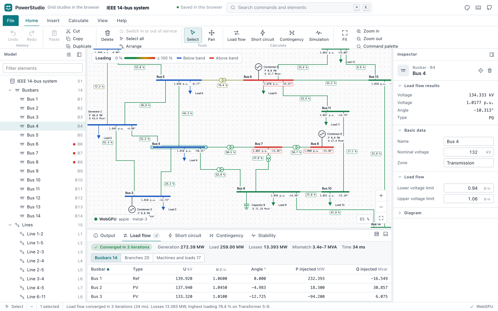

# PowerStudio

**Single-line diagrams, solved in your browser.** PowerStudio is a power system analysis workbench: draw a network
on a single-line diagram and run Newton-Raphson load flow, IEC 60909-style short-circuit currents, N-1 contingency
analysis and electromechanical stability simulation. It runs entirely on your device. There is no account, no
server and no tracking. The calculation engine is written in Rust and runs as WebAssembly in background workers; the
diagram is drawn with WebGPU, with a Canvas 2D fallback.

**Open the app: https://swiftugandan.github.io/powerstudio/app/** · Website: https://swiftugandan.github.io/powerstudio/ ·
Offline copy: download `PowerStudio.html` from the [latest release](https://github.com/swiftugandan/powerstudio/releases/latest)



> PowerStudio is an independent open-source project inspired by the workflow of desktop power system tools such as
> DIgSILENT PowerFactory. It is **not affiliated with, endorsed by or connected to DIgSILENT GmbH**, and it uses none
> of its code, assets or data. PowerFactory is a trademark of its owner.

## Features

| Area | What you can do | How it is checked |
| --- | --- | --- |
| Diagram | Draw busbars, lines, transformers, synchronous machines, external grids, loads and shunts; move, resize, reroute and reconnect; marquee selection, copy and paste, automatic layout; pan and zoom with mouse, trackpad or touch | Browser test draws a network from scratch with the insert tools and solves it |
| Rendering | WebGPU (WGSL signed-distance shapes, SDF text, 4× MSAA) with a real Canvas 2D fallback; the badge shows the backend actually in use and why it fell back | Browser tests in two Chromium projects check the reported backend and decode screenshot pixels |
| Load flow | Newton-Raphson on sparse matrices with reference, PV and PQ busbars, transformer taps and phase shifts, reactive limits, distributed slack, tap, phase shifter and shunt control, area interchange by zone, DC start, load scaling, de-energised islands | Agrees with MATPOWER's algorithm (PYPOWER) on case14, case30 and case118 to 1e-9 p.u., and with pandapower on both samples; the engine solves the 25,000-bus ACTIVSg25k case in 0.3 s as WebAssembly (measured under Node's V8) |
| Short circuit | Three-phase, line-to-line and line-to-earth faults at every busbar or one location; maximum and minimum; Ik″, ip (κ method B or C), Ith, Sk″, branch contributions | Agrees with pandapower's IEC 60909 implementation to about 1e-15 relative (three-phase, line-to-line) and 2e-8 (earth faults) |
| Contingency | N-1 outages of lines, transformers and machines, plus your own contingencies of several elements; remedial actions (switching, redispatch, taps, load shedding) on conditions; optional screening that solves only outages near a limit in full; run in parallel across workers, ranked, with loading and voltage violations and the worst case per element on the diagram; contingency lists import and export as JSON | Outages agree with PowSyBl's security analysis on 22 PSS/E cases and the 2,000-bus ACTIVSg grid; screening never skips an outage that full AC flags; parallel runs equal the sequential result |
| Stability | Classical-model RMS simulation with fault, clearing, tripping and load-step events; rotor angle, speed, power and voltage plots; time cursor on the diagram | Equal-area critical clearing time and the linearised swing frequency |
| Results | Result boxes and colour coding on the diagram, sortable tables, CSV export, an output log, results marked stale after edits, optional recalculation on edit | Browser tests compare table values with MATPOWER |
| Files | Documents saved automatically in IndexedDB; open CGMES 2.4.15 and 3.0 models, PSS/E RAW files (versions 33 and 35) and MATPOWER `.m` cases (also by drag and drop), with a dialog that shows what was read, what the diagram simplifies and how closely it reproduces the imported load flow; export JSON, SVG, PNG and CSV | The engine's imports agree with PowSyBl on 12 CGMES configurations, 23 RAW files and 7 large MATPOWER grids; the editor's version of every one reproduces the imported load flow to 2e-12 p.u.; browser tests import case30 and a RAW file and round-trip an export |
| Data manager | Every element of a class as a spreadsheet: filter, sort, edit a column of many rows at once, paste blocks from Excel or LibreOffice (checked whole before anything changes), copy rows out, export CSV; selection follows the diagram | Browser test edits several rows, pastes a block, refuses a bad paste and undoes; no frame over 50 ms on the 70,000-bus ACTIVSg grid |
| Workspace | Ribbon, model tree, inspector, results dock, status bar, command palette, keyboard shortcuts, undo and redo, light and dark themes, phone layout | Browser tests cover the palette, undo and redo, theme and phone width |
| Samples | IEEE 14-bus system (MATPOWER case14 data) and Riverside, a 110/20/0.4 kV distribution network | Both are oracle inputs |

## Run, build and test

You need Node.js 22 or later and [rustup](https://rustup.rs/), which installs the Rust toolchain pinned in
`engine/rust-toolchain.toml` (with the WebAssembly target) on first use.

```sh
npm ci
npm run build:engine      # compiles the engine to src/engine/powerstudio-engine.wasm (test and build do it too)
npm start                 # development server at http://127.0.0.1:8770/ (no build step)
npm run build             # writes dist/PowerStudio.html, one self-contained file, and its SHA-256
npm run build:pages       # writes _site/: the website at /, the app at /app/, the download and build-info.json
npm run check             # strict type checking with tsc --checkJs
npm run test:engine       # the engine's own tests, native, against the oracle goldens
npm run lint:engine       # rustfmt and Clippy, warnings denied
npm test                  # Node tests: the WebAssembly engine, native and WebAssembly compared, store, import, build
npx playwright install chromium
npm run test:browser      # Playwright against the built file over HTTP, WebGPU and Canvas 2D projects
```

`dist/PowerStudio.html` also works when opened straight from disk (checked in Chromium). Add `?renderer=canvas` to the URL to force the
fallback, or `?sample=ieee14` / `?sample=riverside` to open a fresh copy of a sample. `docs/TESTING.md` covers the
screenshot capture and how to regenerate the oracle goldens.

## Keyboard shortcuts

Mod is ⌘ on macOS and Ctrl elsewhere. Press `?` in the app for the full list, or Mod+K for the command palette.

| Action | Shortcut |
| --- | --- |
| Command palette | Mod+K, Mod+Shift+P |
| Load flow | Alt+L, Mod+Enter |
| Short circuit | Alt+S |
| N-1 contingency | Alt+N |
| Stability simulation | Alt+R |
| Cancel a running calculation | Mod+. or Esc |
| Study case settings | Mod+, |
| Undo, redo | Mod+Z, Mod+Shift+Z or Mod+Y |
| Cut, copy, paste, duplicate | Mod+X, Mod+C, Mod+V, Mod+D |
| Delete selection | Delete or Backspace |
| Select all | Mod+A |
| Switch in or out of service | Shift+O |
| Move selected busbars | Arrow keys (Shift for five grid steps) |
| Select, pan tools | V, H (or hold Space) |
| Insert busbar, line, transformer | B, L, T |
| Insert machine, external grid, load, shunt | G, E, D, C |
| Fit, zoom in, zoom out | F, + or =, − |
| Result boxes, names | Shift+R, Shift+N |
| Switch light and dark theme | Shift+T |
| Model panel, inspector, results panel | Mod+Shift+M, Mod+Shift+I, Mod+J |
| Save now, open, import, export | Mod+S, Mod+O, Mod+Shift+O, Mod+Shift+S |
| Keyboard shortcuts | ? |

## Architecture

The interface is plain ES modules with no runtime dependencies: `src/core/` (document model and undoable store, with
no DOM access), `src/render/` (diagram geometry, a backend-neutral display list and the WebGPU, Canvas 2D and SVG
backends) and `src/ui/` with `src/app.js` (commands, ribbon, tree, inspector, dock, viewport). The calculation engine
is a Rust workspace in `engine/`: a canonical network model, topology processing, a per-unit network built once, and
the solvers on sparse matrices. It compiles to WebAssembly for the browser, where a pool of Web Workers runs it, and
to a native program for tests and benchmarks. `build.mjs` bundles everything, engine included, into one
deterministic HTML file with a Content-Security-Policy that forbids network connections. Read
[docs/ARCHITECTURE.md](docs/ARCHITECTURE.md) for the structure, [docs/ENGINE.md](docs/ENGINE.md) for the models,
conventions and verification of every calculation, and [docs/design/NATIONAL-GRADE.md](docs/design/NATIONAL-GRADE.md)
for where the engine is going.

The interface's only development dependencies are TypeScript (for `--checkJs`), Playwright and the WebGPU type
definitions. The engine depends on faer (sparse LU), serde, serde_json, postcard and sha2.

## Scope and boundaries

PowerStudio is a capable study tool, but it is not a validated engineering product. These are its limits.

**Short circuit.** IEC 60909-style, not certified. The formulas follow pandapower's implementation and the results
are checked only against pandapower; the standard's text and its TR 60909-4 examples were not consulted.
Negative-sequence impedances equal positive-sequence ones. Not implemented: line-to-line-to-earth faults, fault
impedance, breaking current Ib, steady-state current Ik, the DC component, power station unit correction factors
(KS, KSO), converter-fed sources, and the end-temperature correction of line resistance in the minimum case. The
actual tap position is used. KG applies in both cases. Ith assumes n = 1 (far from generators). ip and Ith for earth
faults are computed but have no external reference.

**Load flow.** Balanced, positive sequence only. Not implemented: automatic tap changers, switched shunts, remote
voltage control, voltage-dependent loads, distributed slack, DC lines and converters. The engine's model and topology
processing already handle switches and three-winding transformers, but the editor does not offer them yet (the
IEEE 14 sample models its three-winding transformer as three two-winding units, as the IEEE data does), so in the app
elements are only in or out of service. The engine solves networks of tens of thousands of buses (docs/ENGINE.md
gives the timings), but the diagram editor has been used only with networks of up to a few hundred busbars.

**Contingency.** Contingencies of several elements are listed by hand; there is no automatic N-2 enumeration.
Remedial actions fire once per contingency and do not chain, and there is no optimal redispatch: lost generation
goes to the reference machines, or is shared as the load flow's balance setting says.

**Stability.** Classical model only: no exciters, governors, stabilisers, subtransient dynamics or motor loads;
loads are constant impedances; faults are bolted three-phase faults at busbars. No electromagnetic transients.

**Not part of PowerStudio at all.** Protection coordination, harmonics, optimal power flow, state estimation,
reliability, unbalanced three-phase load flow, cable sizing, arc flash.

**Data and samples.** MATPOWER import reads format version 2. The diagram has no switches, three-winding
transformers or static var compensators yet: an imported network's closed switches join their nodes into one busbar,
a three-winding transformer becomes a star busbar with three two-winding ones, and a compensator becomes a machine
without active power; the import dialog lists every such simplification. Networks of several thousand busbars open
and solve, but their automatic diagram is dense; substation diagrams for them are planned (design phase 4). The IEEE 14 sample's ratings and machine data are
assumptions; on its 132 kV side nothing is earthed, so its earth-fault currents there are a few hundred amperes by
design. Riverside is invented.

**Verified environments.** The browser tests ran in Playwright's Chromium 156 on macOS (WebGPU on an Apple Metal
adapter, and the Canvas 2D fallback in the headless shell) and on GitHub's Ubuntu runners, where Chromium's WebGPU
does not work, so only Canvas 2D ran there; see [docs/TEST-REPORT.md](docs/TEST-REPORT.md). Firefox and Safari were
not tested. Touch and pinch input are implemented but were not tried on a real phone. Keyboard operation and ARIA
roles are in place, but the app has not been audited with a screen reader.

**Storage.** Documents stay in the browser that made them. Clearing site data deletes them; export to keep a copy.
There is no sharing or collaboration.

## Licence

MIT, see [LICENSE](LICENSE). The MATPOWER case files in `tests/fixtures/` are BSD-licensed; see
[docs/research/sources.md](docs/research/sources.md).
