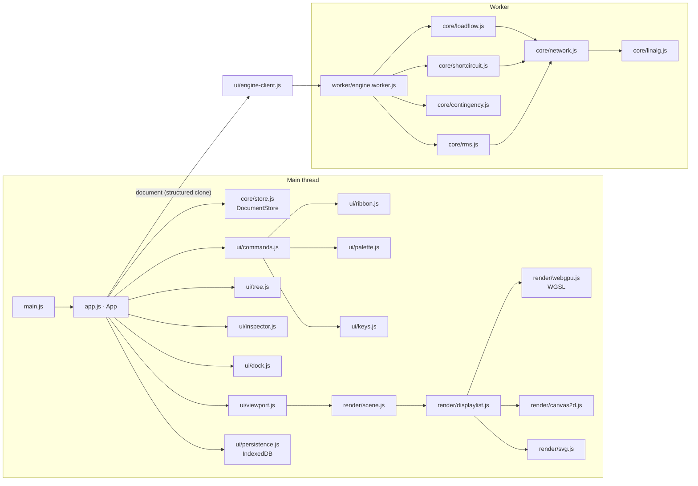

# Architecture

PowerStudio is a static web app: plain ES modules with no framework and no runtime dependencies. In development the
browser loads the modules from `src/` directly; `build.mjs` bundles them into one HTML file for distribution. Data
never leaves the browser: documents live in IndexedDB, preferences in localStorage, and the built page carries a
Content-Security-Policy that forbids network connections.

## Layers

**Core (`src/core/`).** The domain model and the solvers, with no DOM access. `catalog.js` defines every element
class and its fields (type, unit, limits, group, help text); the inspector, the import gate and validation all read
from it. `document.js` holds the document shape, the study case settings and `normalizeDocument`, the single gate
every opened or imported file passes. `store.js` is the only way to change a document: transactions record each
operation with the value it replaced, so undo and redo are exact, and edits that share a coalescing key (a drag,
typing in one field) merge into one step. `network.js` compiles a document into per-unit two-ports; the four solvers
build on it. `docs/ENGINE.md` describes the solvers.

**Rendering (`src/render/`).** `geometry.js` defines the single-line diagram: busbar bars, orthogonal branch routes
with an adjustable middle segment, and the stubs of single-port elements. `scene.js` turns the document, the result
annotations and the editor state into a `DisplayList`: segments, circles, rounded rectangles, triangles and text in
world coordinates, in four layers. Three backends draw the same list:

- `webgpu.js` renders shapes as instanced quads whose edges come from signed distance functions in WGSL, triangles
  as plain geometry, and text from a signed-distance-field glyph atlas (`glyphs.js`) built on demand from the
  browser's own fonts, all into a 4× multisampled target. A dot grid is drawn by a full-screen fragment shader.
- `canvas2d.js` is the fallback. `renderer.js` tries WebGPU (adapter, device and context) and falls back with a
  reason when any step fails; if the GPU device is lost later, the viewport swaps in a fresh canvas with Canvas 2D.
  The backend badge reports the renderer that was actually created.
- `svg.js` exports the list as vector graphics. PNG export draws it with Canvas 2D off screen.

Hit testing (`hittest.js`) works on the geometry in world coordinates, so it does not depend on the backend.

**UI (`src/ui/`, `src/app.js`).** `App` owns the store, the selection, the active tool, calculation results and
preferences, and defines every command. Ribbon buttons, palette entries, context menus and keyboard shortcuts all run
commands by id through `commands.js`, so each action and its enabled and pressed state are defined once. A store
change marks results stale (each result records the network revision it was computed for), re-renders the model tree
and inspector, rebuilds the diagram, re-runs the load flow when "Recalculate on edit" is on, and schedules an autosave.

**Worker (`src/worker/`).** Calculations run in a module worker so the diagram stays responsive; contingency and
stability runs report progress and can be cancelled (the worker is restarted). If a worker cannot be created, the
same solvers run on the main thread.

## Data flow of a calculation

1. A command (`calc.loadflow`, …) checks `validateForCalculation` and sends the document to the worker.
2. The worker compiles the network, solves it and posts the result back.
3. `App` stores the result with the current network revision, logs a summary in the Output panel, and
   `ui/overlay.js` turns the result into diagram annotations (colours and result boxes) and a legend.
4. The dock shows the result tables; the inspector shows the selected element's results.

## Build

`build.mjs` is a small purpose-built bundler. It supports only what the source uses: single-line
`import { … } from '…'` statements and `export function|class|const|let` declarations; anything else fails the
build. It wraps each module in a function registry, bundles the worker separately and starts it from a Blob URL,
inlines the stylesheet and favicon, and adds the Content-Security-Policy. The output, `dist/PowerStudio.html`, is
byte-for-byte deterministic; its SHA-256 is written next to it.

`build-pages.mjs` builds the GitHub Pages site into `_site/`: the website from `site/index.html` at `/`, the app at
`/app/` and the same file as the download `PowerStudio.html`. The website's figures (the IEEE 14-bus studies and the
agreement with the oracles) and its diagram are computed by the engine during the build (`scripts/site-data.mjs`),
the diagram drawn as SVG from the app's own display list with the colours read from `style.css`. The Pages workflow
compares the published `/app/` and `PowerStudio.html` against the build's SHA-256.

## Testing

- `npm test` runs the Node test runner over `tests/*.test.mjs`: solvers against the PYPOWER and pandapower goldens,
  analytic stability checks, the store, the import gate, the diagram geometry and the build.
- `npm run test:browser` runs Playwright against the built file over HTTP, in two projects: `webgpu` (Chromium with
  WebGPU enabled) and `canvas` (the headless shell, which has no WebGPU adapter, so the fallback is exercised).
- `docs/TESTING.md` explains how to regenerate the oracle goldens; `docs/TEST-REPORT.md` records the latest runs.
