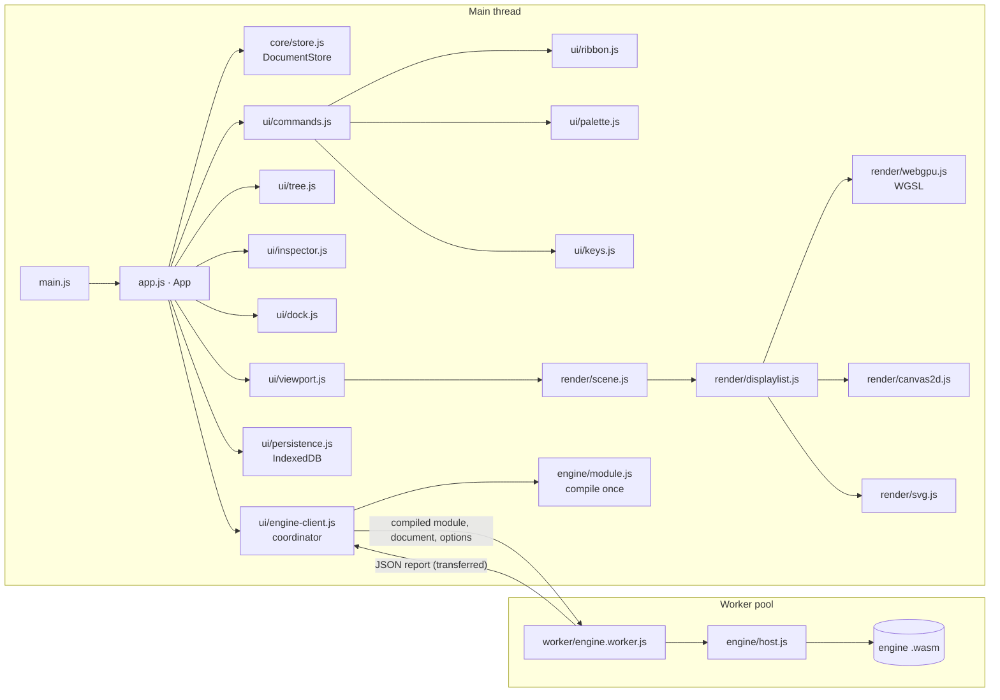

# Architecture

PowerStudio is a static web app with a calculation engine in Rust. The interface is plain ES modules with no
framework and no runtime dependencies; the engine compiles to WebAssembly and runs in Web Workers. In development the
browser loads the modules from `src/` and the engine from `src/engine/powerstudio-engine.wasm`; `build.mjs` bundles
everything, engine included, into one HTML file for distribution. Data never leaves the browser: documents live in
IndexedDB, preferences in localStorage, and the built page carries a Content-Security-Policy that forbids network
connections.

## Layers

**Core (`src/core/`).** The document model of the editor, with no DOM access. `catalog.js` defines every element
class and its fields (type, unit, limits, group, help text); the inspector, the import gate and validation all read
from it. `document.js` holds the document shape, the study case settings and `normalizeDocument`, the single gate
every opened or imported file passes. `store.js` is the only way to change a document: transactions record each
operation with the value it replaced, so undo and redo are exact, and edits that share a coalescing key (a drag,
typing in one field) merge into one step. `matpower.js` and `layout.js` import MATPOWER cases as documents with a
diagram.

**Engine (`engine/`).** A Cargo workspace; `docs/ENGINE.md` describes what it computes.

| Crate | Responsibility |
| --- | --- |
| `ps-num` | Complex numbers and the clock (the host's clock in WebAssembly) |
| `ps-sparse` | Sparse matrices and the `SparseSolver` trait: faer's sparse LU, a dense reference LU, complex systems |
| `ps-model` | The canonical model: equipment, operations with inverses, validation, snapshots, study case settings |
| `ps-io` | Importers: PowerStudio documents, MATPOWER |
| `ps-topology` | Switches and outages to calculation buses, islands and energisation |
| `ps-net` | The per-unit network: every conversion from engineering units, defined once |
| `ps-lf` | Newton-Raphson and DC load flow on sparse matrices |
| `ps-sc` | IEC 60909-style short circuit |
| `ps-dyn` | Classical-model stability simulation |
| `ps-study` | Studies on a model, contingency analysis, reports, and the request interface (`api.rs`) |
| `ps-wasm` | The WebAssembly boundary: `ps_call`, `ps_alloc`, `ps_free` |
| `ps-cli` | `ps`, the native runner for studies and benchmarks |

The workspace forbids `unsafe` code everywhere except the exported functions of `ps-wasm`, denies every Clippy
warning, and bans `unwrap`, `expect` and `panic` outside tests: engine errors reach the user as messages.

**Engine in the browser (`src/engine/`).** `module.js` compiles the WebAssembly module once per page, from the
embedded copy in the built file or from the file in the source tree. `host.js` instantiates it and exchanges
envelopes with it; it runs unchanged on the main thread, in a worker and in Node. `studies.js` sends study requests
and translates the app's options. `reports.js` defines the result types and turns the engine's JSON reports into
them (typed arrays for traces, NaN where JSON carries null).

**Rendering (`src/render/`).** `geometry.js` defines the single-line diagram: busbar bars, orthogonal branch routes
with an adjustable middle segment, and the stubs of single-port elements. `scene.js` turns the document, the result
annotations and the editor state into a `DisplayList`: segments, circles, rounded rectangles, triangles and text in
world coordinates, in four layers. Three backends draw the same list:

- `webgpu.js` renders shapes as instanced quads whose edges come from signed distance functions in WGSL, triangles
  as plain geometry, and text from a signed-distance-field glyph atlas (`glyphs.js`) built on demand from the
  browser's own fonts, all into a 4× multisampled target. A dot grid is drawn by a full-screen fragment shader.
- `canvas2d.js` is the fallback. `renderer.js` tries WebGPU (adapter, device and context) and falls back with a
  reason when any step fails; if the GPU device is lost later, the viewport swaps in a fresh canvas with Canvas 2D.
  The backend badge reports the renderer that was actually created.
- `svg.js` exports the list as vector graphics. PNG export draws it with Canvas 2D off screen.

Hit testing (`hittest.js`) works on the geometry in world coordinates, so it does not depend on the backend.

**UI (`src/ui/`, `src/app.js`).** `App` owns the store, the selection, the active tool, calculation results and
preferences, and defines every command. Ribbon buttons, palette entries, context menus and keyboard shortcuts all run
commands by id through `commands.js`, so each action and its enabled and pressed state are defined once. A store
change marks results stale (each result records the network revision it was computed for), re-renders the model tree
and inspector, rebuilds the diagram, re-runs the load flow when "Recalculate on edit" is on, and schedules an autosave.

**Workers (`src/worker/`, `src/ui/engine-client.js`).** Each worker holds one engine instance, created from the
compiled module the page sends it, so the module is compiled once however many workers start. The engine client
runs ordinary studies on the first worker and spreads contingency analysis across a pool (one worker per spare CPU
core, up to eight), then has the engine merge the chunks. Workers need no SharedArrayBuffer, so the app works from
GitHub Pages and from a file on disk. Cancelling terminates the busy workers. If workers cannot start, one engine
runs on the main thread.

## Data flow of a calculation

1. A command (`calc.loadflow`, …) checks `validateForCalculation` and hands the document to the engine client.
2. The worker serialises the document into a study request; the engine imports it into its model (re-using the
   previous import when the document is unchanged), processes the topology, builds the per-unit network, solves, and
   returns the report as JSON, which the worker transfers back without copying.
3. `App` stores the adapted result with the current network revision, logs a summary in the Output panel, and
   `ui/overlay.js` turns the result into diagram annotations (colours and result boxes) and a legend.
4. The dock shows the result tables; the inspector shows the selected element's results.

## Build

`scripts/build-engine.mjs` compiles the engine for `wasm32-unknown-unknown` with SIMD128, using the toolchain pinned
in `engine/rust-toolchain.toml` and the dependency versions locked in `engine/Cargo.lock`, and writes
`src/engine/powerstudio-engine.wasm` with its SHA-256. `npm test` and `npm run build` run it first.

`build.mjs` is a small purpose-built bundler. It supports only what the source uses: single-line
`import { … } from '…'` statements and `export function|class|const|let` declarations; anything else fails the
build. It wraps each module in a function registry, bundles the worker separately and starts it from a Blob URL,
embeds the engine gzip-compressed (the page decompresses it with the browser's `DecompressionStream`), inlines the
stylesheet and favicon, and adds the Content-Security-Policy, whose `'wasm-unsafe-eval'` allows compiling
WebAssembly and nothing else. The output, `dist/PowerStudio.html`, is byte-for-byte deterministic; its SHA-256 is
written next to it.

`build-pages.mjs` builds the GitHub Pages site into `_site/`: the website from `site/index.html` at `/`, the app at
`/app/` and the same file as the download `PowerStudio.html`. The website's figures (the IEEE 14-bus studies and the
agreement with the oracles) and its diagram are computed by the engine during the build (`scripts/site-data.mjs`),
the diagram drawn as SVG from the app's own display list with the colours read from `style.css`. The Pages workflow
compares the published `/app/` and `PowerStudio.html` against the build's SHA-256.

## Testing

- `npm run test:engine` runs the engine's tests natively: the oracle goldens for every study, the model's operations
  and snapshots, topology processing, the sparse solvers, and the chunked contingency merge.
- `npm test` builds the WebAssembly engine and runs the Node test runner over `tests/*.test.mjs`: the same oracle
  checks through the WebAssembly build, a comparison of every study's report between the native and WebAssembly
  engines, determinism across runs and instances, the store, the import gate, the diagram geometry and the build.
- `npm run test:browser` runs Playwright against the built file over HTTP, in two projects: `webgpu` (Chromium with
  WebGPU enabled) and `canvas` (the headless shell, which has no WebGPU adapter, so the fallback is exercised).
- `docs/TESTING.md` explains how to regenerate the oracle goldens; `docs/TEST-REPORT.md` records the latest runs.
