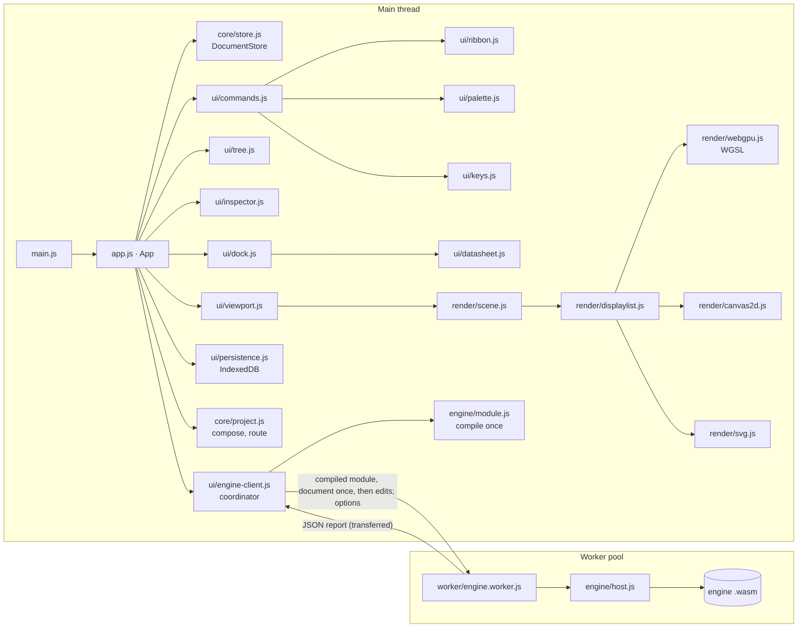

# Architecture

PowerStudio is a static web app with a calculation engine in Rust. The interface is plain ES modules with no
framework and no runtime dependencies; the engine compiles to WebAssembly and runs in Web Workers. In development the
browser loads the modules from `src/` and the engine from `src/engine/powerstudio-engine.wasm`; `build.mjs` bundles
everything, engine included, into one HTML file for distribution. Data never leaves the browser: documents live in
IndexedDB, preferences in localStorage, and the built page carries a Content-Security-Policy that forbids network
connections.

## Layers

**Core (`src/core/`).** The document model of the editor, with no DOM access. `catalog.js` defines every element
class and its fields (type, unit, limits, group, help text); the inspector, the import gate and validation all read
from it. `document.js` holds the document shape, the study case settings and `normalizeDocument`, the single gate
every opened or imported file passes. `contingencies.js` checks the study case's own contingencies and remedial
actions, for documents and for the contingency file alike, so a rule can never end up wider than written.
`sealed.js` seals a project with a passphrase (AES-256-GCM through Web Crypto, the key from the engine's Argon2id)
and opens it again.
`store.js` is the only way to change a document: transactions record each
operation with the value it replaced, so undo and redo are exact, and edits that share a coalescing key (a drag,
typing in one field) merge into one step. `layout.js` draws a diagram for networks that arrive without one: an exact
force-directed layout up to 400 busbars, and above that a multilevel one. It coarsens the network by matching
neighbouring busbars level after level, lays out the coarsest graph in full and refines each finer level from its
groups' positions, with repulsion found through a counting-sorted grid of typed arrays. Overlaps are then removed row
by row with the least movement that keeps a margin between bars (pool-adjacent-violators), so regions stay together.
On ACTIVSg70k the median branch spans 660 drawing units and none crosses a tenth of the drawing; the row packing it
replaced left a median of 19,840 and 66,000 such branches. 2,000 busbars lay out in about 0.1 s, 10,000 in 0.4 s
and 70,000 in 2.7 s, in the worker that imports them; Arrange runs the same layout in the first worker and applies
the result as one transaction (at 70,000 busbars about 650,000 position changes, 150 ms), dropping it if the network
changed meanwhile. Position changes are not sent to the engines, which never read them.

**Engine (`engine/`).** A Cargo workspace; `docs/ENGINE.md` describes what it computes.

| Crate | Responsibility |
| --- | --- |
| `ps-num` | Complex numbers and the clock (the host's clock in WebAssembly) |
| `ps-sparse` | Sparse matrices and the `SparseSolver` trait: faer's sparse LU, a dense reference LU, complex systems |
| `ps-model` | The canonical model: equipment, operations with inverses, validation, snapshots, study case settings |
| `ps-io` | Importers: PowerStudio documents, MATPOWER, CGMES 2.4.15 and 3.0, PSS/E RAW 32, 33 and 35 with DYR; the import report |
| `ps-topology` | Switches and outages to calculation buses, islands and energisation |
| `ps-net` | The per-unit network: every conversion from engineering units, defined once |
| `ps-lf` | Newton-Raphson and DC load flow on sparse matrices |
| `ps-sc` | IEC 60909-style short circuit |
| `ps-dyn` | Stability simulation: machines and their controls solved with the network by the implicit trapezoidal rule (see below) |
| `ps-study` | Studies on a model, contingency analysis, reports, the request interface (`api.rs`), the benchmark kit's comparison (`compare.rs`) and key derivation for encrypted projects (`crypto.rs`) |
| `ps-wasm` | The WebAssembly boundary: `ps_call`, `ps_alloc`, `ps_free` |
| `ps-cli` | `ps`, the native runner for studies and benchmarks |

The workspace forbids `unsafe` code everywhere except the exported functions of `ps-wasm`, denies every Clippy
warning, and bans `unwrap`, `expect` and `panic` outside tests: engine errors reach the user as messages.

**Stability (`ps-dyn`).** `scalar.rs` defines the numbers model equations are written over (`f64`, and dual numbers
that carry one derivative); `block.rs` the variable layout and the standard blocks; `machine.rs`, `exciter.rs`,
`governor.rs` and `stabiliser.rs` the models; `unit.rs` evaluates a machine with its controls in a fixed order (stator,
governor, stabiliser, exciter, rotor), the field voltage being an algebraic variable so an exciter may read the stator
current it drives. `sim.rs` assembles every unit and the network's current balance into one system, steps it with the
implicit trapezoidal rule and Newton's method on a sparse Jacobian of fixed pattern, holds anti-windup limits and
applies events. A machine's dynamic data live in `ps_model::MachineDynamics`: the classical fields every machine has,
the rotor model with its round-rotor data, and `Controls` (exciter, governor, stabiliser), each a `ControllerKind` with
its parameters in DYR order. In the document they are flat generator fields plus three `controller` fields holding
`null` or `{ model, …parameters }`; the inspector edits a control's parameters in a group under its model choice, and
the data sheet shows the model's name. `ps-io/src/dyr.rs` applies a PSS/E DYR file to a model read from RAW.

**Engine in the browser (`src/engine/`).** `module.js` compiles the WebAssembly module once per page, from the
embedded copy in the built file or from the file in the source tree. `host.js` instantiates it and exchanges
envelopes with it; it runs unchanged on the main thread, in a worker and in Node. `studies.js` sends study requests
and translates the app's options. `exchange.js` sends other tools' files (CGMES, PSS/E RAW, MATPOWER) to the engine,
which returns an import summary and a document. `reports.js` defines the result types and turns the engine's JSON reports into
them (typed arrays for traces, NaN where JSON carries null).

**Rendering (`src/render/`).** `geometry.js` defines the single-line diagram: busbar bars, orthogonal branch routes
with an adjustable middle segment, and the stubs of single-port elements. `scene.js` turns the document, the result
annotations and the editor state into display lists: segments, circles, rounded rectangles, triangles and text in
world coordinates, held in growable Float32 buffers. The diagram (`buildScene`, four layers) depends on neither the
zoom nor the selection: result boxes and halos carry the smallest zoom at which they show, and every backend filters
by it as it draws, so panning and zooming never rebuild it. The overlay (`buildOverlay`) holds what changes with the
editor's state, the highlights of the selection and the hovered element under the diagram and the handles and the
tool's preview over it, and is cheap to rebuild on every pointer move. The viewport invalidates the diagram, the
overlay or only the view, and rebuilds a diagram in steps (`sceneSteps`, then the backend's `packSteps`) of a few
milliseconds per frame, keeping the previous one on screen until the new one is ready; at 70,000 busbars a rebuild
spreads over a few dozen frames.

A national diagram (from 5,000 elements) has levels of detail. Each voltage level shows from the zoom at which the
lines and busbars of it and every higher level would cover a tenth of the screen (`levelZooms`): ACTIVSg70k shows
its 765 and 500 kV network when it fits the window and every level from 14 %. A branch belongs to the lower voltage
of its ends, symbols show once they are 3 px across, and an element with a violation (an overload, a voltage outside
its band) shows at every zoom. Shapes and triangles carry their minimum zoom, as result boxes do, and the legend
dims the levels the view leaves out. Smaller diagrams draw everything at every zoom.

**Labels (`labels.js`, `metrics.js`).** Every text on the diagram is a label: busbar, element and branch names and
every result box. The scene builds the diagram in two passes: the first draws the elements and records their
footprints (bars and symbols as solid, routes and stubs as lines) on a grid over the drawing, and collects a label
request for each text with its measured size and an ordered list of candidate positions, the first of which is the
label's default place; the second places the labels and draws them. The placer is greedy, in priority order (labels
the user dragged, then violations, then names, busbar boxes, element boxes, loading boxes, flow boxes), and gives each
label the first candidate that overlaps nothing, or else the cheapest by area overlapped, distance and rank, searching
rings around the anchor with an orthogonal leader line back to it when every candidate collides. Touching another
label costs more than anything else, so on both samples and for every study no label overlaps another. A label the
user dragged keeps its offset from its default place in the owner's `labels` field. With "Disentangle labels" off,
every label takes its default place. Requests are flat records and the grid lives in typed arrays, so the 560,000
labels of a 70,000-busbar diagram with a load flow on it place in about 1.5 s, spread over frames, with no step over
100 ms in Chromium (`scripts/scene-bench.mjs`). Text is measured with the fonts the renderers draw (`canvasMeasure`);
Node, which has no fonts, uses widths that err wide (`conservativeMeasure`), and a browser test checks they do in
every browser. The display list carries the placed labels (`list.labels`), which the viewport uses to hit-test them
and exports use to size the drawing.

Three backends draw the same lists:

- `webgpu.js` renders shapes as instanced quads whose edges come from signed distance functions in WGSL, triangles
  as plain geometry, and text from a signed-distance-field glyph atlas (`glyphs.js`) built on demand from the
  browser's own fonts, all into a 4× multisampled target. A dot grid is drawn by a full-screen fragment shader.
- `canvas2d.js` is the fallback. `renderer.js` tries WebGPU (adapter, device and context) and falls back with a
  reason when any step fails; if the GPU device is lost later, the viewport swaps in a fresh canvas with Canvas 2D.
  The backend badge reports the renderer that was actually created.
- `svg.js` exports the list as vector graphics. PNG export draws it with Canvas 2D off screen.

Hit testing (`hittest.js`) works on the geometry in world coordinates, so it does not depend on the backend. A
`HitIndex`, built once per document revision, keeps the diagram's orthogonal segments (busbars, branch routes and
stubs) sorted by position, so the pointer looks at the band of segments around it rather than at every element; a
test checks that it finds exactly what a full scan finds.

**Diagram input (`src/ui/tools/`).** The viewport owns the camera, the frames and the renderer, and hands pointer
input to the active tool as normalised events (world and screen position, modifiers). A tool (`select.js`, `place.js`)
decides what a press does and returns a gesture (`gestures.js`: pan, marquee, move, slide, resize, bend, reconnect,
label), which receives the movements and the release; each edit gesture writes through `store.transact` with one
coalescing key, so a whole drag is one step in the history. Panning with the middle button or Space, pinching and the
wheel work the same in every tool. `snap.js` (no DOM) snaps what a gesture proposes: to the lines of the busbars on
screen (start, centre and end on either axis, within six screen pixels), to points a gesture prefers (a branch end in
line with the branch's other end), or to the grid, and returns the guides the overlay draws; Alt turns it off. A
cancelled drag reverts its own step (`store.revert`), and a drag's steps merge however long it pauses.
`core/diagram-ops.js` holds the Arrange tab's operations (align, distribute, same length, rotate, flip, spread
connections), each returning field changes the app applies as one transaction.

**UI (`src/ui/`, `src/app.js`).** `App` owns the store, the selection, the active tool, calculation results and
preferences, and defines every command. Ribbon buttons, palette entries, context menus and keyboard shortcuts all run
commands by id through `commands.js`, so each action and its enabled and pressed state are defined once. A store
change marks results stale (each result records the network revision it was computed for), re-renders the model tree
and inspector, rebuilds the diagram, re-runs the load flow when "Recalculate on edit" is on, and schedules an autosave.
The model tree (`tree.js`, above 2,000 rows) and the result tables (`table.js`, above 500 rows) are virtual: they
keep every row's description, sort with one shared collator, and put only the rows in view into the page, so a
70,000-busbar network opens in about a second and its tables scroll freely. Code that takes the extent of large
arrays uses `core/extent.js`, because spreading them into `Math.min` overflows the call stack. Dialogs that edit
the study case (`study.js`, `contingency-editor.js`) work on a draft and write it back in one transaction on Apply.
Fields that choose an element (busbar fields above 200 busbars, the fault location, simulation event targets, the
contingency editor) are text boxes whose suggestion lists fill only when first focused, since a large network has
tens of thousands of candidates.

The data manager (`datasheet.js`, the Data tab of the dock) shows every element of one class as a virtual
spreadsheet. Its columns are the catalogue's field specs, as in the inspector, and every change is a store
transaction: a value typed into a cell, the same value written to every selected row, or a block pasted from another
spreadsheet, which is parsed and checked whole before anything changes. It repaints only the rows in view, keeps each
class's column widths once measured, and restyles rows in place on selection changes (replacing cells between the
two clicks of a double-click would lose it). On ACTIVSg70k no frame takes over 50 ms while it opens, scrolls, edits,
filters, sorts or changes class.

Nothing a user does on a national network may hold the page for more than a frame or two, and the work that would is
cut into steps: opening a document runs the import gate (`normalizeSteps`) in slices between frames; a calculation's
result reaches the colours, the results table and the panels in separate tasks; the output log renders once per
frame however many lines arrive. Autosave (`persistence.js`) serialises the base document to JSON a few thousand
elements at a time and starts again if the document changes meanwhile, so it only ever stores one consistent state.

**Projects (`core/project.js`, `ui/project-page.js`).** What opens is a project: the network as built (the base
document), variants (planned changes to the equipment, kept as the editor's operations), scenarios (values of the
fields the catalogue marks `operating`: switching, setpoints, loads, generation, taps) and study cases (a scenario, the
active variants and the calculation settings). The editor works on the active case's composition (`composeSteps`,
in slices): the base, each active variant replayed in project order, then the scenario's values, with the case's
settings as the document's study. Variants replay tolerantly over a base changed since they were recorded. Every
store change is routed to its part (`route`), copying values as they are recorded:

1. a calculation setting goes to the active study case;
2. an operating value goes to the active scenario, when the case has one;
3. a drawing field goes to wherever the element is kept (the base, or the variant that added it);
4. anything else goes to the variant being recorded (the title bar's study case chip shows it), to the variant that
   added the element, or to the base.

Switching study case, or changing which variants or scenario a case uses, recomposes and reopens the editor: results
and undo history clear, the view stays. So does changing where edits are recorded, which clears history so an undo
never lands somewhere else than its edit did. A composition that applies variants or a scenario passes the import
gate. IndexedDB (version 3) stores a project by part, so an edit rewrites only what it changed: the base document's
JSON, its catalogue entry (all a listing reads), and its manifest, variants and scenarios as separate records; the
run log has a store of its own. Documents saved before projects open as projects with one study case. A project
exports to one file (`powerstudio-project`) with its run log and imports back as a new project.

Every calculation the user starts appends a run record (`App.recordRun`, NATIONAL-GRADE.md section 9.2): the study
case, scenario and variants by name, the engine's version and the SHA-256 of its WebAssembly (hashed when the module
loads), the SHA-256 of the model as calculated (`Model::content_hash`, so moving or renaming on the diagram does not
change it), of the study case and of the report without its timings, all computed in the engine, and the outcome. A
load flow solved from a previous solution also names that start's hash, since its result depends on the start to
within the tolerance. Recalculations on edit are not recorded. Each recorded run also keeps its report as the engine
wrote it, gzip-compressed (`results`, version 4 of the database), so the results dock can compare the current load
flow with any recorded one: difference columns beside the values they compare (Δu, ΔAngle, ΔLoading, ΔP), and a
filter to the rows that changed. The result tables also filter to rows near or beyond their limits, and the
contingency results list each branch's and busbar's worst post-contingency state with the outage behind it, so "every
branch above 90 % in any contingency" is one click. The Project page's run log deletes a run with its report.

The study report (`ui/report.js`) lays the active study case out for print or saving as PDF: a cover with the
network, the study case, its scenario and variants and the run record of each result (results calculated on edit say
they were not recorded), then each calculation's key figures, the rows that matter (violations first, at most forty),
its settings, and the diagram with the results on it, in the light palette, for networks of up to 4,000 elements. It
is built into `#print-root`, which print shows alone (`@media print` in `style.css`), and cleared after printing.

**Workers (`src/worker/`, `src/ui/engine-client.js`).** Each worker holds one engine instance, created from the
compiled module the page sends it, so the module is compiled once however many workers start. The engine client
runs ordinary studies on the first worker and spreads contingency analysis across a pool (one worker per spare CPU
core, up to eight): four chunks of outages per worker, handed out as workers come free, so the slow stretch at the
end of the list (machines, network splits) does not hold one worker while the rest wait; the engine then merges the
chunks from their bytes, in chunk order, so the result is the sequential one. Workers need no SharedArrayBuffer, so the app works from
GitHub Pages and from a file on disk. Cancelling terminates the busy workers. If workers cannot start, one engine
runs on the main thread.

Each worker's engine holds the open document. The client sends a worker the whole document as JSON once (serialised
in slices by `serialise`, the same function autosave uses, and shared by every worker of the pool), which the engine
reads with `doc_open`; after that it forwards each store change's operations, which the engine applies to its
document (`doc_edit`). A calculation names the document state it expects (`opened:edits`); a worker whose engine is
behind, such as one started after a cancel or one whose edit failed, receives the whole document again first, once.
So a calculation never copies the document on the page's thread, a contingency analysis over eight workers does not
copy it eight times, and the engine does not read the document's text again after an edit.

Memory sets the pool's lifetime. At 70,000 buses an engine that reads the document whole peaks at 478 MB, and one
holding it open at 618 MB, because the open document is a JSON tree (324 MB) beside its model; WebAssembly memory
never shrinks. So the pool's other workers end after each contingency analysis and only the first stays resident;
the next analysis starts them again and sends them the document (about 0.4 s each, in parallel). Each engine reports
its memory with every reply, and the status bar shows the engines running and their total. A contingency analysis
starts no more workers than half the device's memory holds at the first engine's size (where the browser reports the
device's memory), and a worker that runs out of memory ends while the others finish its chunks: fewer workers, the
same result, and a note in the Output panel (`tests/pool.test.mjs` checks both with stand-in workers). Holding each element
as its text and parsing it only while converting would cut both figures; it is the next step if memory becomes the
limit.

## Data flow of a calculation

1. A command (`calc.loadflow`, …) checks `validateForCalculation` and hands the document to the engine client.
2. The worker serialises its copy of the document into a study request; the engine imports it into its model (re-using the
   previous import when the document is unchanged), processes the topology, builds the per-unit network, solves, and
   returns the report as JSON, which the worker transfers back without copying.
3. `App` stores the adapted result with the current network revision, logs a summary in the Output panel, and
   `ui/overlay.js` turns the result into diagram annotations (colours and result boxes) and a legend.
4. The dock shows the result tables; the inspector shows the selected element's results.

## Data flow of an import

1. `App.importFiles` takes the picked or dropped files. A PowerStudio document goes straight through
   `normalizeDocument`; anything else is read as bytes and sent to the engine client, which transfers the buffers to
   the first worker (`{ type: 'import', files }`).
2. The engine (`ps-study`'s `exchange::import_for_editor`) recognises the format by extension or content, imports it
   into its model with the import report, validates the model, converts it into a document (`ps-io`'s
   `powerstudio_write`), and solves both to measure how closely the document reproduces the model. The worker lays
   the document out and sends it back with the summary.
3. `ui/import-dialog.js` shows the summary: format and size, the measured agreement, what the editor's document
   simplifies, the import notes, the validation findings and every class read. Opening the network passes the
   document through `normalizeDocument` like any file, and its load flows start from the imported voltages, then
   from their own last solution.

## Build

`scripts/build-engine.mjs` compiles the engine for `wasm32-unknown-unknown` with SIMD128, using the toolchain pinned
in `engine/rust-toolchain.toml` and the dependency versions locked in `engine/Cargo.lock`, and writes
`src/engine/powerstudio-engine.wasm` with its SHA-256. `npm test` and `npm run build` run it first.

`build.mjs` is a small purpose-built bundler. It supports only what the source uses: single-line
`import { … } from '…'` statements and `export function|class|const|let` declarations; anything else fails the
build. It wraps each module in a function registry, bundles the worker separately and starts it from a Blob URL,
embeds the engine gzip-compressed (the page decompresses it with the browser's `DecompressionStream`), inlines the
stylesheet and favicon, and adds the Content-Security-Policy, whose `'wasm-unsafe-eval'` allows compiling
WebAssembly and nothing else, and which requires Trusted Types: HTML reaches the page only through `setHtml`
(`src/ui/dom.js`, policy `powerstudio`) and the worker starts only from its own Blob URL (policy
`powerstudio-worker`, created in the bundle's prelude). The output, `dist/PowerStudio.html`, is byte-for-byte deterministic; its SHA-256 is
written next to it.

`build-pages.mjs` builds the GitHub Pages site into `_site/`: the website from `site/index.html` at `/`, the app at
`/app/` and the same file as the download `PowerStudio.html`. The website's figures (the IEEE 14-bus studies and the
agreement with the oracles) and its diagram are computed by the engine during the build (`scripts/site-data.mjs`),
the diagram drawn as SVG from the app's own display list with the colours read from `style.css`. The Pages workflow
compares the published `/app/` and `PowerStudio.html` against the build's SHA-256.

The engine build is reproducible: `scripts/build-engine.mjs` remaps the cargo registry and checkout paths that panic
locations would embed, and `scripts/check-reproducible.mjs` builds again from a copy elsewhere with a fresh cargo home
and requires the same bytes; CI compares builds on Ubuntu and macOS. `scripts/sbom.mjs` writes the CycloneDX bill of
materials. A tag runs `.github/workflows/release.yml`, which builds, checks, attests and drafts the release.

## Testing

- `npm run test:engine` runs the engine's tests natively: the oracle goldens for every study, the model's operations
  and snapshots, topology processing, the sparse solvers, and the chunked contingency merge.
- `npm test` builds the WebAssembly engine and runs the Node test runner over `tests/*.test.mjs`: the same oracle
  checks through the WebAssembly build, a comparison of every study's report between the native and WebAssembly
  engines, determinism across runs and instances, the store, the import gate, the diagram geometry and the build.
- `npm run test:browser` runs Playwright against the built file over HTTP, in four projects: `webgpu` (Chromium with
  WebGPU enabled), `canvas` (the headless shell, which has no WebGPU adapter, so the fallback is exercised), `firefox`
  and `webkit`, with an axe-core accessibility audit among the specs.
- `docs/TESTING.md` explains how to regenerate the oracle goldens; `docs/TEST-REPORT.md` records the latest runs.
