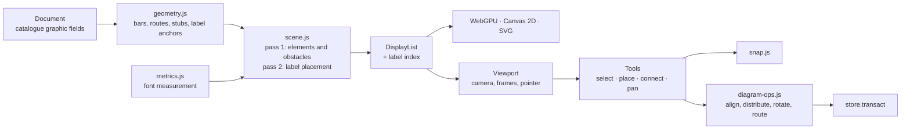

# Diagram editing to professional CAD standard

Status: approved 2026-10-10; C0 to C3 done locally on branch `cad` (docs/TEST-REPORT.md), C4 to follow.
Follows release 1.0.0 (docs/design/NATIONAL-GRADE.md); planned as release 1.1.

## 1. Summary

The single-line diagram is where an engineer spends most of their time in PowerStudio, and it is the part furthest
from professional standard. The calculations behind it meet national-operator standard; the diagram does not yet let
an engineer read every result, place things exactly, or tidy a drawing quickly. This design brings the diagram editor
to the standard of a professional CAD tool, in five phases that each ship on their own:

| Phase | Delivers |
| --- | --- |
| **C0. Foundations** | The viewport's input handling split into tools; text measured with the renderer's own fonts; the drawing fields declared once, in the catalogue |
| **C1. Labels** | Automatic placement of every name and result box without overlaps; leader lines; labels you can drag and pin; a View option to switch placement off; correct export extents |
| **C2. Precision** | Snapping to grid, objects and alignment guides; window and crossing selection; align, distribute, rotate and flip; selection commands |
| **C3. Routing** | Branch routes with editable bends that stay orthogonal; routing around obstacles on demand |
| **C4. Navigation** | An overview map; zoom to selection |

C1 fixes the problem that started this work, so it ships first after the foundations it needs.

## 2. What is wrong today

**Labels collide.** After a load flow, 45 of the 80 result boxes on the IEEE 14-bus sample and 18 of the 42 on the
Riverside sample overlap another result box or a busbar name (measured from the display list, 2026-10-10). Every
label sits at a fixed offset from its element: a busbar's voltage box under the right end of the bar, a branch's flow
boxes beside the branch where it leaves the bar, a loading box beside the middle of the longest segment. Nothing
checks what is already there. Where two connections leave a bar close together, or a connection leaves near the bar's
end, the boxes stack, and the busbar names under them become unreadable.

**Placement is coarse.** Busbars snap to a 20-unit grid and connections to a 10-unit step along their bar; there is no
snapping to other elements, no alignment guides, and no way to align or distribute a selection. The marquee selects
by anchor point only. A busbar's orientation and an element's side change only in the inspector.

**Routes are fixed in shape.** A branch has one adjustable segment (its `bend`); a route cannot take a second bend
to get round a busbar in its way, so on a dense diagram routes run through bars and symbols they do not connect to.

**Large drawings are hard to navigate.** There is no overview of where the view sits in the whole drawing, and no
command to bring the selection into view at a useful zoom.

**The code makes all of this harder than it should be.** `src/ui/viewport.js` mixes the camera, rendering and every
gesture of every tool in one 635-line class; the drawing fields that must stay away from the engine are listed by hand
in `store.js` (`DRAWING_KEYS`), separately from the catalogue that defines them; and the scene builder guesses text
widths (`characters × 0.56 em`), so any placement built on it would be wrong for the fonts actually drawn.

## 3. Principles

1. **Direct manipulation first, exact values always.** Everything visible can be dragged; everything dragged can also
   be typed in the inspector or moved with the keyboard.
2. **The user's intent wins.** Automatic placement fills gaps; it never moves something the user placed by hand.
3. **One geometry.** `src/render/geometry.js` remains the only place that says where things are. The scene, hit
   testing, snapping, label placement, SVG and PNG export all read it.
4. **Deterministic.** The same document, results and settings give the same drawing, in the app, in the report and in
   the website build.
5. **National scale.** Every feature works on the 70,000-bus diagram within the existing bar: no frame over 100 ms.
6. **Drawing is not data.** Moving a label, a bend or a busbar never marks results as old, never reaches the engine
   and never lands in a variant's recording.

## 4. Architecture

### 4.1 Modules

| Module | Responsibility | DOM |
| --- | --- | --- |
| `src/render/geometry.js` | Bars, routes (now with waypoints), stubs, and each label slot's anchor | No |
| `src/render/metrics.js` | Text widths: the browser measures with the glyph atlas's fonts; Node uses a conservative table | No (takes a measuring function) |
| `src/render/labels.js` | Label slots, candidate positions, the placer and its spatial hash, the label index | No |
| `src/render/scene.js` | Builds the display list in two passes; returns the label index with it | No |
| `src/render/routing.js` | Obstacle-avoiding orthogonal routes (C3) | No |
| `src/ui/snap.js` | Grid, object and alignment snapping; returns the snapped point and the guides to draw | No |
| `src/core/diagram-ops.js` | Align, distribute, same length, rotate, flip, label reset, route straightening, as transactions | No |
| `src/ui/viewport.js` | Camera, frames, renderer, pointer normalisation, touch, wheel; hands gestures to the active tool | Yes |
| `src/ui/tools/*.js` | One module per tool behind one interface; gestures as small classes | Yes |
| `src/ui/overview.js` | The overview map (C4) | Yes |

The pure modules run in Node, so the placer, the snapper, the router and the operations get unit tests without a
browser.

### 4.2 Tools

A tool is an object with `cursor`, `hint`, `down(p, e)`, `move(p, e)`, `up(p, e)`, `key(e)`, `cancel()` and
`preview()`. The viewport owns one active tool and forwards normalised pointer events (world point, screen point,
modifiers, pointer type). Pan by middle button, Space or two fingers stays in the viewport, above any tool.

| Tool | Gestures |
| --- | --- |
| Select | Click (again at the same spot to reach what lies beneath), marquee (window or crossing), move, slide a connection, resize a bar, drag a route segment, reconnect a branch end, drag a label |
| Place busbar, Place element | A ghost that follows the pointer and snaps; click to place |
| Connect (line, transformer) | Click and click, or press on one busbar and release on the other; rubber band with validity feedback |
| Pan | Drag to move the view |

Each drag is a gesture object (`MoveGesture`, `SlideGesture`, `ResizeGesture`, `SegmentGesture`, `ReconnectGesture`,
`LabelGesture`, `MarqueeGesture`) with `move`, `end` and `cancel`. Escape cancels a gesture by undoing its coalesced
transaction, so a cancelled drag leaves no trace in the history.

### 4.3 The drawing fields

Every field of the catalogue's `graphic` group is drawing, and `DRAWING_KEYS` is derived from the catalogue instead of
listed by hand. The new fields:

| Field | On | Holds |
| --- | --- | --- |
| `labels` | Every class | A map from label slot to `[dx, dy]`, the offset the user dragged that label to from its default position; empty by default |
| `route` | Lines, transformers | The interior corners of a manual route, `[[x, y], …]`; empty for an automatic route |

The inspector's Diagram group shows them as summaries with a reset button ("2 labels moved · Reset", "Manual route,
4 bends · Straighten"). The data manager already leaves graphic fields out. The engine's document reader ignores
fields it does not know (`ps-io/src/powerstudio.rs` reads by key), so neither field reaches it; documents of 0.1 and
1.0 open with both empty.

## 5. Labels (C1)

### 5.1 The label model

A label is anything drawn as text on the diagram: busbar names, element names, branch names and every result box.
Each has an owner element, a **slot** (`name`, `box`, `endA`, `endB`, `mid`), a measured size, a priority, and an
ordered list of **candidate positions** relative to its anchor. The first candidate is today's position, so a diagram
with placement switched off looks as it does now.

| Slot | Anchor | Candidates, in order of preference |
| --- | --- | --- |
| Busbar `name` | Start of the bar | Above the start; above the end; below the start; below the end |
| Busbar `box` | End of the bar | Below the end; below the start; above the end; below the middle; above the middle |
| Branch `endA`, `endB` | Where the route leaves the bar | Beside the first segment on either side, sliding away from the bar in steps of the box height up to half the segment |
| Branch `mid` | Middle of the longest segment | Either side, sliding from the middle towards both ends up to 40 % of the segment; then the next longest segment |
| Branch `name` | As `mid`, the other side | As `mid` |
| Element `name` | Beside the symbol | Beside, either side; beyond the symbol |
| Element `box` | Under the name | Under the name; beside it; on the other side of the symbol |

When every candidate collides, the placer searches rings around the anchor at two, four and six grid steps, eight
positions per ring, and draws a **leader line**, a thin segment from the label's nearest edge to its anchor, so the
label's owner stays clear.

### 5.2 Placement

Placement is a second pass over the scene. The first pass draws every element and records each one's footprint as an
obstacle (bars, route segments, stubs, symbols, transformer circles); it also collects the label requests. The second
pass places the labels, draws them and builds the label index.

The placer is greedy, in priority order, over a uniform spatial hash of 64-unit cells:

1. **Pinned labels**, which the user dragged, go where the user put them and become fixed obstacles.
2. **Violations** (an overloaded branch, a voltage outside its band) next, so they get the best positions.
3. Then busbar names, element names, busbar boxes, element boxes, loading boxes, flow boxes and branch names, each
   group in document order.

For each label it scores the candidates in order and takes the first with no cost. If none is free, it takes the
cheapest, scored as:

| Term | Weight |
| --- | --- |
| Overlap with another label | 10⁶ per unit² (a collision with text is the failure this design exists to remove) |
| Overlap with a busbar or a symbol | 10³ per unit² |
| Overlap with a route segment or a stub | 10 per unit² |
| Distance from the first candidate | 1 per unit, plus the leader's length |

The search is bounded (at most the candidates plus 24 ring positions), so a label in an impossible spot costs a fixed
amount and takes the least bad position instead of searching on.

Greedy placement with good candidates is the standard practical answer to label placement, which is NP-hard in general;
Christensen, Marks and Shieber (1995) found that iterative improvement such as simulated annealing places better labels
at many times the cost. On a schematic, most labels have free space close by, which is where greedy placement does
well, and it is deterministic and runs in one pass, which the stepped scene build needs (ADR C-1).

A label's visibility zoom (from the levels of detail, and the 6.5 px rule for result boxes) does not change its
collisions: at the closest zoom every label shows at once, so all of them must fit together.

### 5.3 Text measurement

The placer is only as good as its rectangles. In the browser the scene builder receives a measuring function that
returns advance widths from the same fonts the renderers draw (the glyph atlas measures with `measureText`; Canvas 2D
draws with `fillText` in the same font stacks). In Node (tests, the website build) a conservative table stands in:
0.6 em for the monospaced face and 0.62 em for the sans face, wider than any face in the font stacks, so a layout that
fits in Node fits in the browser. SVG export uses the browser's measurements; a viewer that substitutes a wider font
can still overlap, which the documentation states.

### 5.4 Pinned labels

Any label can be dragged. The Select tool tests the label index before the elements, so pressing on a label and
dragging moves it; clicking it selects its owner. A dragged label is pinned: its offset goes into the owner's `labels`
field through `store.transact` (one undoable step per drag), and it keeps that offset relative to its anchor when the
element moves. A pinned label beyond its first ring gets a leader line.

"Reset label positions" (View tab, context menu on a label or a selection) clears the offsets of the selection's labels,
or of every label when nothing is selected.

### 5.5 The option

View, Annotations gains **Disentangle labels** (Shift+L), on by default. Off, every label sits at its first candidate
(today's positions, plus any pinned offsets): fast and predictable, for users who prefer labels in fixed places.
On, the placer runs. The preference is per browser, like the other annotation switches.

### 5.6 Extents

Exports and Fit take the diagram's extent from the display list's real bounds, labels included, instead of the
busbars' bounds plus a fixed margin, so a displaced label is never cut off an exported PNG or SVG.

## 6. Precision (C2)

### 6.1 Snapping

`snap.js` takes a proposed point, what is being moved, the zoom and the modifiers, and returns the snapped point and
the guides to draw. In order of precedence:

| Snap | Applies to | Feedback |
| --- | --- | --- |
| Object | A connection to a bar end, centre or existing connection position; a bar end to another bar's end | A square marker at the point |
| Alignment | A bar's centre or ends to another bar's centre or ends, on either axis, within 6 screen pixels | A dashed guide through both |
| Grid | Everything else; the step is set on the View tab (10, 20 or 40 units, default 20) | None |

Holding Alt suspends snapping for the drag (positions are then whole units). Guides and markers draw in the overlay
layer, so they never rebuild the scene. While dragging, the status bar shows the movement (Δx, Δy) or the bar's length.

### 6.2 Selection

- **Window and crossing.** A marquee dragged from left to right selects what lies wholly inside it (solid outline); from
  right to left it selects whatever it touches (dashed outline). This is the convention of AutoCAD and most CAD tools,
  and it replaces today's selection by anchor point.
- **Cycling.** Where elements overlap under the pointer, clicking again at the same spot selects the next one beneath.
  Tab keeps moving focus between the panels, so the diagram never traps the keyboard.
- **Commands:** Select connected (a busbar's connections, or an element's busbar), Select same class, Select voltage
  level. On the Home tab and the context menu.

### 6.3 Arranging a selection

A new **Arrange** tab (the Home tab had no room for a group this size, and the commands belong together), also in the
context menu, which offers those that apply to the selection:

| Command | Key | Does |
| --- | --- | --- |
| Align left, centre, right, top, middle, bottom | — | Lines the busbars up on the first selected busbar's edge or centre |
| Distribute horizontally, vertically | — | Equal gaps between busbars, keeping the outer two |
| Same length | — | Every busbar takes the first selected one's length |
| Rotate | R | Switches a busbar between horizontal and vertical about its centre; its connections keep their positions along it |
| Flip side | X | Moves selected machines, loads and shunts to the other side of their bar |
| Spread connections | — | Spreads the selected busbars' connections evenly (`arrangeConnections`, for a selection) |

Each is one transaction in `diagram-ops.js`. The existing whole-diagram Arrange stays, renamed Lay out diagram so it no
longer shares a name with the tab.

### 6.4 Moving

A multi-selection moves as a whole: busbars move, their connections follow, and the manual routes between two moved
busbars translate with them. A single selected machine, load or shunt slides along its bar and flips side when dragged
across it, as now.

## 7. Routing (C3)

### 7.1 Automatic and manual routes

A route with no `route` field is **automatic**: today's three-segment route with its `bend`, which Arrange and import
produce and which follows its busbars wherever they go. A route with corners in `route` is **manual**: it keeps those
corners. Its first segment leaves its bar at right angles and its last enters the other at right angles; when a busbar
moves, the corner next to that end slides along the segment's axis to stay in line, so a manual route stays orthogonal
without the user touching it.

### 7.2 Editing

A selected branch shows a handle on every segment. Dragging a segment moves it at right angles to itself, and the
segments either side stretch; dragging the first or last segment inserts the corners that keep the ends at right
angles. That turns an automatic route into a manual one. Double-clicking a corner removes it when the segments either
side line up. "Straighten route" returns a selection to automatic routes.

### 7.3 Routing around obstacles

"Route around obstacles" (Home, Arrange; context menu) computes, for each selected branch, the orthogonal route that
avoids busbars and symbols it does not connect to, minimising length plus a penalty per bend, by the method of Wybrow,
Marriott and Stuckey (2009): an orthogonal visibility graph over the obstacles' padded rectangles, searched with A*.
The result is stored as a manual route. A new branch drawn with the Connect tool is routed this way when its automatic
route would cross a busbar or symbol.

It runs on demand and on new branches only, never on import or Arrange: the multilevel layout already chooses
positions so that routes are short (its measured median span and crossings on ACTIVSg70k stay the baseline, and a test
keeps them), and routing 90,000 branches around obstacles would cost seconds for little gain at a zoom where no one
reads them (ADR C-3). Budget: 500 branches in 200 ms.

## 8. Navigation (C4)

**Overview map.** A panel in the diagram's lower right corner shows the whole drawing, without text, with the view as
a rectangle; drag the rectangle or click elsewhere to move the view. It draws from the display list through Canvas 2D
into a cached bitmap, rebuilt when the scene is. View, Panels, "Overview map" (M); off by default below 200 busbars,
where the whole drawing fits on screen anyway.

**Zoom to selection** (Shift+F, View tab and context menu) fits the selection with a margin.

## 9. User interface

| Where | Adds |
| --- | --- |
| Arrange tab | Select: select connected, same kind, voltage level; Align: six commands; Spacing: distribute both ways, same length; Turn: rotate, flip side; Connections: spread connections, lay out diagram; Routes (C3): route around obstacles, straighten route |
| View tab | Labels: Disentangle labels, Reset label positions; Grid: step 10, 20, 40; Navigate: zoom to selection; Panels: overview map |
| Context menu | On a label: Reset label position. On a selection: the Arrange commands that apply; zoom to selection |
| Inspector, Diagram group | Labels moved, with Reset; route kind and bends, with Straighten |
| Status bar | Movement and length while dragging; snapping state |
| Keys | R rotate, X flip side, Shift+L disentangle labels, Shift+F zoom to selection, M overview map, Alt suspend snapping. None is owned by the browser |

Every command is in the command palette. Cursors say what a press will do (move, resize, route, label). The user
guide gains a "Working on the diagram" section; the screenshots are refreshed in both themes and at phone width, where
the Arrange commands live in the context menu and the overview map stays hidden.

## 10. Decisions

| # | Decision | Rejected |
| --- | --- | --- |
| C-1 | Labels are placed by a greedy, priority-ordered placer over candidate positions, deterministic and in one pass | Simulated annealing and force-directed placement: better on dense maps, but many times slower, not incremental, and non-deterministic without care; the stepped build of a 70,000-bus diagram cannot afford it |
| C-2 | A label the user drags is stored on its element as an offset (`labels`), a drawing field | Positions kept per browser: lost on export and invisible to the team. Absolute positions: wrong as soon as the element moves |
| C-3 | Routes are automatic until edited; routing around obstacles runs on demand and for new branches | Routing every branch after every move or import: seconds at national scale, and it would overwrite the layout's results |
| C-4 | The drawing fields are the catalogue's `graphic` group; `DRAWING_KEYS` is derived from it | Keeping the hand list: every new drawing field risks marking results old and entering variants |
| C-5 | Input handling moves into tools and gestures behind one interface, as a refactor that changes no behaviour, before the new tools land | Growing `viewport.js`: every gesture of C1 to C3 would land in the same class |
| C-6 | No new display-list primitive: leaders and guides are segments, markers are rectangles | A dashed-rectangle or arrow primitive in three renderers for cosmetic gain |

## 11. Phases and acceptance

Each phase ends with the full suite green in all four browser projects, the documentation updated and screenshots
reviewed in both themes and at phone width.

| Phase | Done when |
| --- | --- |
| **C0** | The tool split changes no behaviour: the 155 browser tests pass unchanged. `DRAWING_KEYS` equals the catalogue's graphic fields. The scene measures text through `metrics.js` |
| **C1** | No result box or name overlaps another on either sample for any study's results (a Node test over the display list, and the screenshots); the same scene twice gives identical bytes; pinned labels keep their offsets through moves, undo and export; a synthetic 70,000-bus grid with load-flow results places its labels within the frame budget; Playwright drags a label, resets it and switches the option in all four projects |
| **C2** | Snapping, guides, window and crossing selection, cycling, align, distribute, rotate and flip are covered by Node tests of `snap.js` and `diagram-ops.js` and by browser tests of the gestures |
| **C3** | Manual routes stay orthogonal through bus moves (property test over random moves); routed branches cross no busbar or symbol they do not connect to; 500 branches route within 200 ms; the layout's span and crossing measurements on ACTIVSg70k are unchanged |
| **C4** | The overview map follows the view and moves it, at 70,000 buses within the frame budget; zoom to selection frames the selection |

## 12. Not in this design

Substation diagrams from the node-breaker model, several diagrams per project, and CGMES DL and GL layouts (all
deferred by ADR 12 of NATIONAL-GRADE.md); geographic backgrounds; free text, frames and title blocks on the diagram;
line-crossing marks; user-defined symbols; result-box templates (which quantities a box shows).

## 13. References

- J. Christensen, J. Marks and S. Shieber, "An empirical study of algorithms for point-feature label placement", ACM
  Transactions on Graphics 14(3), 203–232, 1995. https://dash.harvard.edu/bitstream/1/2032678/2/AnEmpiricalStudy.pdf
- M. Wybrow, K. Marriott and P. J. Stuckey, "Orthogonal connector routing", Graph Drawing 2009, LNCS 5849, 219–231,
  2010; implemented in libavoid. https://www.adaptagrams.org/documentation/libavoid.html
- DIgSILENT, network diagrams and graphic features of PowerFactory (the reference product's diagram scope).
  https://www.digsilent.de/en/network-diagrams-and-graphic-features.html
