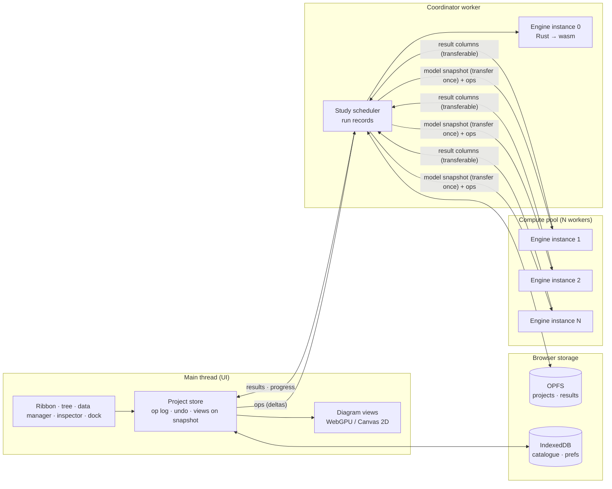

# PowerStudio National: production design

| | |
| --- | --- |
| Status | In progress: phases 0, 1 and 2 complete (see section 11) |
| Date | 2026-10-09 |
| Scope | Take PowerStudio from a small-network study tool to studies a national transmission operator can rely on, still entirely in the browser, with no server |
| Starting point | PowerStudio 0.1.0 (this repository): JavaScript solvers with dense matrices, bus-branch model, WebGPU diagram |

## 1. Summary

PowerStudio 0.1.0 computes correctly, but only on small bus-branch networks with a narrow set of models. A national
operator needs four things it lacks: models of tens of thousands of buses, the equipment and controls those models
contain, the exchange formats operators use (CGMES in Europe, PSS/E in North America), and evidence that the results
can be trusted and reproduced.

This design moves every calculation into a **Rust engine compiled to WebAssembly**, built around a sparse solver and a
node-breaker network model shaped after the CGMES profiles. The engine runs in a **pool of Web Workers**, one
independent WebAssembly instance each, so contingency and time-series studies use every core without
SharedArrayBuffer, which GitHub Pages cannot enable. Projects live in the browser's **Origin Private File System**.
The existing user interface, renderer, command and undo architecture carry over and are extended for scale. Every
study run leaves a **record** that names the engine build, the model and the settings, so a result can be traced and
reproduced.

The plan starts with a spike that settles the one decision everything else depends on: whether the sparse LU in
`faer` meets the performance target in `wasm32`, or an in-house KLU-style solver is needed.

## 2. What "national operator standard" means here

The phrase is only useful with tests that pass or fail. The design must clear three bars. The numbers are targets to
verify in the browser, not measurements.

| Bar | Pass criteria |
| --- | --- |
| **Model fidelity** | Imports the ENTSO-E CGMES conformity test configurations and the Texas A&M ACTIVSg25k and ACTIVSg70k cases without loss that affects the solution. Load flow on them agrees with PowSyBl OpenLoadFlow to 1e-6 p.u. in voltage and 1e-3 MW/Mvar in branch flows, with the same controls enabled. |
| **Scale** | AC load flow on a 70,000-bus model converges in under 2 s in Chromium on a current laptop (cold start, including factorisation), under 0.5 s from a warm start. A full N-1 on a 10,000-bus model (about 13,000 outages) completes in under 2 minutes on 8 workers. The UI stays responsive (no frame over 100 ms) throughout. |
| **Assurance** | The engine builds reproducibly: the same commit yields the same `.wasm` SHA-256 on two machines. Every study run is recorded with engine version, `.wasm` hash, model hash, scenario hash, settings, convergence data and a results hash. Results can be exported as a self-contained study package that re-runs to the same results hash. |

Every section below exists to clear one of these bars.

What it does **not** promise: certification, acceptance by a specific operator, or agreement with that operator's
own tool on its own model. Only the operator can run that last comparison; section 9.4 gives them a kit to do it.

## 3. Constraints

- **No purchases.** No paid standards, tools, libraries, data or services. Every dependency, reference model and
  validation source in this design is free and openly licensed.
- **Browser only, no server.** All computation, storage and file handling happen on the user's device. The app is a
  static site (GitHub Pages) and stays installable as one offline HTML file.
- **Local-first and sealed.** No account, no telemetry, `connect-src 'none'`. A national model is critical
  infrastructure data; that it never leaves the device is a requirement, not a side effect.
- **No runtime JavaScript dependencies, no framework.** The UI stays plain ES modules with strict `tsc --checkJs`.
  Build-time tooling (the Rust toolchain) is allowed.
- **Static hosting cannot set HTTP headers.** GitHub Pages cannot send the COOP and COEP headers that cross-origin
  isolation needs, so SharedArrayBuffer and WebAssembly threads are unavailable without a service-worker workaround
  ([GitHub community discussion](https://github.com/orgs/community/discussions/13309)).
- **32-bit WebAssembly memory.** `wasm32` addresses at most 4 GiB per instance. Memory64 ships in Chrome (133+) and
  Firefox (134+) but not in Safari ([caniuse](https://caniuse.com/wf-wasm-memory64),
  [WebKit bug 300538](https://bugs.webkit.org/show_bug.cgi?id=300538)), so 4 GiB per instance is the design ceiling.
- **Browsers.** Chromium-based browsers are the primary target (WebGPU, OPFS, File System Access API). Firefox and
  Safari must work, with features detected rather than assumed.

## 4. Architecture



- **The UI owns editing; the engine owns physics.** The UI keeps the project as an operation log over a binary
  snapshot. Edits go to the coordinator as small typed operations (set attribute, add, remove, switch), not as whole
  documents, so a one-field edit on a 70,000-bus model costs microseconds, not a full transfer.
- **The coordinator** holds the authoritative engine instance, applies operations, runs single studies (load flow,
  short circuit at one point), splits batch studies (contingencies, time series, multi-point short circuit) across the
  pool, and writes run records and results to OPFS.
- **Pool workers** each hold a full engine instance and a copy of the model, received once as a transferable binary
  snapshot and then kept current with the same operations. Work is handed out in small batches so slow cases do not
  stall the pool.
- **The pool is sized** from `navigator.hardwareConcurrency` and the memory budget (section 6.3), capped so the tab
  stays within what the browser allows.

## 5. The engine (Rust)

### 5.1 Workspace layout

| Crate | Responsibility |
| --- | --- |
| `ps-num` | Complex numbers and the clock (the host's clock in WebAssembly) |
| `ps-model` | Canonical network model: equipment classes, identifiers, operations with inverses, validation, the binary snapshot format, study case settings |
| `ps-topology` | Topology processor: switch states → electrical nodes, islands, energisation; maps between node-breaker and bus-branch views |
| `ps-sparse` | Sparse matrices (CSC), orderings, and the `SparseSolver` trait with its implementations |
| `ps-lf` | AC load flow (Newton-Raphson polar and current-injection, fast decoupled), DC load flow, control outer loops |
| `ps-sens` | Sensitivities: PTDF, LODF, voltage and loss sensitivities, used by contingency screening |
| `ps-ca` | Contingency definitions, screening, AC verification, remedial actions, limit evaluation |
| `ps-sc` | Short circuit: IEC 60909-0 equivalent voltage source method and the superposition (complete) method |
| `ps-dyn` | Electromechanical (RMS) simulation: DAE solver, events, the dynamic model library |
| `ps-io` | Importers and exporters: CGMES 2.4.15 and 3.0, PSS/E RAW and DYR, MATPOWER, PowerStudio JSON (0.1 documents) |
| `ps-net` | The per-unit network: every conversion from engineering units, used by every study |
| `ps-study` | Studies on a model, their reports, and the request interface shared by `ps-wasm` and `ps-cli` |
| `ps-wasm` | The browser boundary: one entry point, `ps_call`, exchanging envelopes (ADR-10) |
| `ps-cli` | Native command-line runner over the same crates, for CI, benchmarking and oracle comparison |

`ps-cli` matters as much as `ps-wasm`: it runs the same code natively, so the oracle suite, fuzzing and benchmarks run
in CI at native speed, and differential tests compare native against wasm.

### 5.2 Network model

The model follows the **CGMES split between equipment and state**, because operators already think in those terms
and because it makes CGMES import a structural fit rather than a conversion:

| Layer | Holds | CGMES profile it maps to |
| --- | --- | --- |
| Equipment | Substations, voltage levels, bays, busbar sections, switches, lines, two- and three-winding transformers, tap changers, machines, loads, shunts, HVDC and FACTS devices, ratings and limits | EQ |
| Topology | Connectivity nodes and terminals (node-breaker), or buses directly (bus-branch) | TP (derived) |
| Steady-state hypothesis | Switch states, setpoints, tap positions, load and generation values, regulating controls | SSH |
| Solution | Voltages, flows, tap positions after solving | SV |
| Diagram | Schematic and geographic positions | DL, GL |
| Dynamics | Dynamic model assignments and parameters | DY |

Identifiers are strings (CIM mRIDs for CGMES models) and every element keeps its own; inside the engine elements
refer to nodes by dense `u32` index. Each class is a table of records (ADR-11): a record serialises, validates and
round-trips as one value, and the model compiles to the per-unit network, which is where the solvers need contiguous
arrays. Result columns, which the UI reads in bulk, are the columnar part of the design.

**Operations** are the only way to change the model: insert, replace, set one field, remove, restore, and batches
that apply whole or not at all. They address elements by class and identifier, so a log stays valid while tables
grow, and applying one returns its exact inverse. The same operation log is to drive undo and redo in the UI,
incremental updates in every worker, scenario and variant overlays (section 7), and the audit trail. A field edit
currently round-trips its record through JSON; that is fast enough for interactive edits and is to be measured
before scenario overlays at 70,000 buses rely on it.

### 5.3 Topology processing

The 0.1 engine works on bus-branch data. National models are node-breaker: a substation is busbar sections joined by
breakers and disconnectors. `ps-topology` reduces the switch graph to electrical nodes with a union-find over closed
switches, finds islands and energised parts, and keeps the mapping both ways so results land back on equipment and on
diagrams. A switch operation re-runs only the affected substation's reduction. The symbolic sparse factorisation is
reused until the reduced topology changes.

### 5.4 Sparse linear algebra

Newton-Raphson on a 70,000-bus network solves a system of about 140,000 unknowns with on the order of one million
non-zeros, and every iteration has the same sparsity pattern. What matters is a fill-reducing ordering, a symbolic
factorisation done once per topology, and fast numeric refactorisation.

**Decision (ADR-2):** the engine depends only on a `SparseSolver` trait (`analyse`, `factor`, `refactor`, `solve`,
`solve_transpose`). The first implementation wraps the sparse LU of [faer](https://docs.rs/faer/latest/faer/sparse/linalg/lu/index.html),
a pure-Rust library whose 0.24 release separates symbolic (`SymbolicLu`) and numeric (`NumericLu`) factorisation and
offers simplicial and supernodal variants. Its documentation does not confirm the ordering it uses, whether the
symbolic result can be reused across numeric factorisations, or its behaviour on `wasm32`. **Phase 0 measures these**
on ACTIVSg25k and ACTIVSg70k Jacobians in the browser. The fallback, if faer misses the target, is an in-house
KLU-style left-looking LU (Gilbert-Peierls with partial pivoting) with AMD ordering and block triangular form, which
is well documented in the literature and small enough to own.

The current dense LU stays as a test oracle for small systems. Solves use iterative refinement when the residual is
poor, and the solver reports its condition estimate so near-singular cases (islanded parts, zero-impedance loops) are
diagnosed instead of silently wrong.

### 5.5 Load flow

The 0.1 load flow (Newton-Raphson, reactive limits, DC start, islands) carries over and gains what national models
need:

- **Equipment:** three-winding transformers, phase-shifting transformers with continuous angle, HVDC links (LCC and
  VSC, as power injections with converter losses and controls), SVCs and STATCOMs, series compensation,
  voltage-dependent loads (ZIP and exponential).
- **Controls**, each as an outer loop with a documented order and dead bands: transformer tap control (local and
  remote voltage), phase-shifter flow control, switched shunts, remote and shared voltage control by machines,
  reactive limits with switching back, distributed slack by participation factors, area interchange control.
- **Methods:** Newton-Raphson (polar), fast decoupled (for screening), DC (for sensitivities and starting points),
  with line search when an iteration increases the mismatch.
- **Diagnostics:** which buses carry the largest mismatch, which controls did not settle, which islands were
  de-energised, and why a case failed, in words an engineer can act on.

### 5.6 Contingency analysis

- **Definitions:** single elements, multiple elements (N-2 and common-mode), busbar faults (a substation's switching
  state applied), generator and HVDC outages, plus user-defined lists. Imported from and exported to a documented JSON
  format; CGMES contingency data is mapped where the source model carries it.
- **Screening, then verification:** DC sensitivities (PTDF and LODF) rank every outage in seconds. Every outage that
  could approach a limit, and every outage on a must-check list, then gets a full AC load flow from the base-case
  solution. Screening is an accelerator only; any case can be forced to full AC, and the design must show on the
  ACTIVSg cases that screening never misses a case that full AC flags (a test, section 9.1).
- **Remedial actions:** declarative rules (conditions on flows, voltages or switch states, leading to actions such as
  switching, redispatch or tap changes) applied after the post-contingency solution, with the rule that fired recorded
  in the result.
- **Limits:** permanent and temporary current limits per branch end (CGMES operational limits), voltage bands per
  voltage level, evaluated against the study case's criteria (for example the operator's N-1 rules).
- **Parallelism:** outages are batched across the pool. Each worker re-uses its symbolic factorisation where the
  outage does not change the pattern, and refactors locally where it does.

### 5.7 Short circuit

0.1 implements an IEC 60909-style calculation checked against pandapower. National use needs the full standard:

- Breaking current Ib (with the μ and q factors), steady-state current Ik, the DC component and asymmetrical breaking
  current, Ith with both m and n.
- Power station unit correction factors (KS, KSO), all fault types including line-to-line-to-earth, fault impedance.
- Converter-fed sources (wind, solar, HVDC) as current sources, as the 2016 edition allows.
- The **superposition (complete) method** from a solved load flow, which many operators use alongside the equivalent
  voltage source method.

**Validation without the standard.** The IEC documents are not bought. The strongest free reference is
pandapower's BSD-licensed test suite, which encodes the IEC TR 60909-4 example network (380, 110, 30 and 10 kV with
power station units, a three-winding transformer, an asynchronous motor and two infeeds) together with the expected
currents its authors take from the report, and a further VDE example
([`test_iec60909_4.py`](https://github.com/e2nIEE/pandapower/blob/develop/pandapower/test/shortcircuit/test_iec60909_4.py)).
Porting those networks and values, with attribution, gives second-hand access to the report's results. The
calculation keeps the label "IEC 60909-style" permanently: agreement with the example as pandapower encodes it is
evidence, not conformance, and the app says so. An operator that holds the standard can check further with the
benchmark kit (section 9.4).

### 5.8 Stability (RMS simulation)

- **Solver:** the differential-algebraic system (machine and control states, network voltages) is integrated with
  the implicit trapezoidal rule and solved simultaneously by Newton's method, re-using the sparse factorisation
  between steps while the iteration converges quickly. Events (faults, switching, setpoint changes) and discontinuities
  (limiters, relays) are located by zero-crossing detection.
- **Models:** each dynamic model is a Rust type implementing a `DynModel` trait that contributes residuals and their
  Jacobian. Every hand-written Jacobian is checked against finite differences in CI.
- **Library, delivered in waves**, each model validated against an open reference simulator (ANDES or Dynawo) on a
  published case before it ships:

| Wave | Models (PSS/E naming) |
| --- | --- |
| D1 | GENCLS, GENROU, GENSAL; SEXS, ESST1A, EXST1, IEEET1; TGOV1, HYGOV, IEEEG1; PSS2A; static and ZIP loads |
| D2 | GGOV1; WECC generic renewable models (REGC_A, REEC_A, REPC_A, and the later B/C variants); HVDC and SVC dynamics |
| D3 | Grid-forming converter models; under-frequency and under-voltage load shedding; distance and over-current protection as event sources |

- **Data:** PSS/E DYR import maps names to library models and reports every model it could not map, with the
  machines it affects; such machines fall back to an explicitly flagged classical model only if the user agrees.

The library is the largest single body of work in the design and the part operators scrutinise most. It grows by
evidence, wave by wave, not all at once.

### 5.9 Numerical conventions and determinism

- One per-unit system, documented in `docs/ENGINE.md`, shared by every study.
- **Native and wasm results agree within tolerance, not bit for bit.** Native builds may use fused multiply-add and
  wider SIMD; wasm uses its own instruction set. Differential tests (section 9.1) bound the difference. Within one
  build and one browser, results are deterministic: no randomness, a fixed reduction order, and parallel batches
  merged in outage order.

## 6. Browser runtime

### 6.1 Build and loading

- The engine compiles with a pinned Rust toolchain (`rust-toolchain.toml`), `cargo build --locked` and
  `--target wasm32-unknown-unknown` with SIMD128, with no other tools. The `.wasm` hash is recorded in every build
  and is to be recorded in every study record.
- The single-file build embeds the `.wasm` gzip-compressed and decompresses it with the built-in
  `DecompressionStream`, so the offline HTML file still works. The module was 931 KB (316 KB compressed) at the end
  of phase 1 and is 1.56 MB (509 KB compressed) at the end of phase 2, mostly the CGMES, RAW and document code. The main thread compiles it once and sends the compiled module to every worker.
- The Content-Security-Policy gains `'wasm-unsafe-eval'` in `script-src` (required to compile WebAssembly) and keeps
  `connect-src 'none'`.

### 6.2 Concurrency (ADR-3)

Independent WebAssembly instances in a Web Worker pool, with the model transferred once as a binary snapshot and kept
current with operations. This needs no SharedArrayBuffer, so it works on GitHub Pages and from a file on disk.

Rejected: `coi-serviceworker`, which emulates COOP and COEP from a service worker. It forces a reload on first visit,
does not work from `file://`, and adds a moving part between the user and a sealed app. If the app is ever hosted where
headers can be set, single-instance threads (for one very large factorisation) can be added behind feature detection
without changing the pool design.

### 6.3 Memory budget

Each worker has its own 4 GiB ceiling, but the tab as a whole must stay modest. Phase 0 measured the WebAssembly
memory of one engine instance after loading a MATPOWER case and solving it (the module's linear memory, which never
shrinks, so this is the peak):

| Case | Buses | Branches | Engine memory |
| --- | --- | --- | --- |
| ACTIVSg10k | 10,000 | 12,706 | 18 MB |
| ACTIVSg25k | 25,000 | 32,229 | 50 MB |
| ACTIVSg70k | 70,000 | 88,207 | 256 MB |

The 70k figure includes the 19 MB case text and its parse; the canonical model and result storage will move it, and
it is re-measured at the end of phase 1.

At 70,000 buses, eight workers need about 2 GB, which a desktop browser can hold. The pool shrinks automatically
when `navigator.deviceMemory` or a failed allocation says otherwise, and studies degrade to fewer workers rather than
fail. Results are never held whole in memory: contingency results stream to OPFS as compact columns (per outage: worst
loadings and voltages, violated elements), and full post-contingency states are kept only for the cases the user
opens.

### 6.4 Storage

- **Projects live in OPFS** (Origin Private File System), one directory per project: the base model snapshot,
  scenarios and variants as operation logs, diagrams, study cases, contingency lists, result files and the run log.
  OPFS handles hundreds of megabytes efficiently through synchronous access handles in workers.
- **IndexedDB keeps the catalogue** (project list, metadata) and preferences.
- The app requests persistent storage (`navigator.storage.persist()`), shows the quota and usage, and warns when the
  browser has not granted persistence. Projects export to a single archive file at any time, and import back.
- Where the File System Access API is available (Chromium), a project can live in a folder the user picks, so it sits
  in their own backup and version control.

## 7. Projects, scenarios and studies

Operators study the same network under many conditions. The project structure makes that explicit:

| Object | Is | Built from |
| --- | --- | --- |
| **Network model** | The equipment, as built | Imported CGMES EQ, PSS/E RAW, or drawn |
| **Variant** | A planned change to equipment (a new line, a replaced transformer), with an in-service date | Operation log over the model |
| **Scenario** | An operating point: switch states, setpoints, loads, generation, taps | CGMES SSH, PSS/E RAW, time-series import, or edits |
| **Study case** | What to run: one scenario, the active variants, the calculation settings, contingency lists, monitored elements | Chosen by the user |
| **Run** | One execution of a study case, with its record and results | Produced by the engine |

Scenarios can be generated from time series (one per hour of a year, for example), and batch runs execute a study
case across many scenarios on the pool.

**Import and export**, in priority order:

1. CGMES 2.4.15 and 3.0: EQ, TP, SSH, SV, DL, GL, DY, with boundary sets. Export of SSH and SV, so results can go back
   to the operator's toolchain. PowSyBl supports both versions and is the reference for interpretation
   ([PowSyBl documentation](https://powsybl.readthedocs.io/)).
2. PSS/E RAW (versions 33 to 35) and DYR.
3. MATPOWER (as today) and PowerStudio 0.1 JSON documents, migrated on open.

Every import produces a **validation report**: what was read, what was mapped approximately and how, what was dropped
and why, and data plausibility checks (impedances, ratings, isolated equipment). An import never silently changes the
physics.

## 8. Workspace at national scale

### 8.1 What carries over

The ribbon, command registry, palette, shortcuts, inspector field specs, undo and redo, themes and the deterministic
single-file build all carry over. The solvers in `src/core/` are replaced by the engine; their tests become tests of
the engine.

### 8.2 Diagrams

- **Several diagrams per project:** a network overview (schematic or geographic from CGMES GL), substation
  single-line diagrams generated from the node-breaker model (busbar sections, bays, breakers, disconnectors), and
  user-drawn diagrams. Imported CGMES DL layouts are used when present.
- **Renderer at scale:** the display-list design stays, but the scene becomes persistent GPU buffers with a range per
  element, updated incrementally when an element or its results change, instead of rebuilt per change. A spatial grid
  index serves culling and hit testing. Levels of detail draw a 70,000-bus overview as substations and corridors when
  zoomed out, and full detail when zoomed in; labels have their own detail tiers.
- **Canvas 2D fallback** cannot draw every element of a national overview each frame. At large scale it draws the
  coarser level of detail and caches tiles, and says so on the badge.

### 8.3 Data manager and results

- A **data manager**: virtualised, spreadsheet-style tables per equipment class with filtering, sorting, multi-edit,
  copy and paste to and from spreadsheets, and the same validation as the inspector. This is how engineers edit
  national models; editing one element at a time on a diagram does not scale.
- **Result browser:** virtualised tables over result columns, filters such as "all branches above 90 % in any
  contingency", comparison of two runs or two scenarios with differences highlighted, and export to CSV.
- **Reports:** printable study reports (browser print to PDF) with the run record on the cover page.

## 9. Assurance

### 9.1 Verification

| Layer | Method |
| --- | --- |
| Sparse solver | Property-based tests (random sparse systems, residual bounds), comparison with the dense LU on small systems, stress tests on the SuiteSparse matrices of the ACTIVSg cases |
| Load flow | Goldens from PowSyBl OpenLoadFlow on the CGMES conformity configurations and ACTIVSg cases; PYPOWER and pandapower goldens kept from 0.1; power-balance residual checks independent of the solver |
| Contingency | Every screened-out case re-run in full AC on the reference cases to show screening misses nothing; agreement with PowSyBl security analysis |
| Short circuit | pandapower goldens kept; the TR 60909-4 and VDE example networks ported from pandapower's open test suite, with their expected currents |
| Dynamics | Per model: Jacobian by finite differences; per wave: agreement with ANDES or Dynawo on published cases, plus the analytic checks from 0.1 |
| Importers | Round trips (import, export, import, compare), the CGMES conformity configurations, and fuzzing of every parser (`cargo-fuzz`) |
| Native against wasm | The full oracle suite runs on both and results must agree within stated tolerances |
| Performance | Native benchmarks (`criterion`) and browser timings (Playwright) in CI, with a failing gate on regressions beyond a set margin |
| UI | The current Playwright suite, extended to Firefox and WebKit projects and to national-scale models |

As in 0.1, the oracle goldens are generated by a pinned script from pinned versions, committed, and checked for
staleness. Every reference model is free: MATPOWER (BSD), the Texas A&M synthetic grids, and the ENTSO-E CGMES test
configurations. The CGMES 3.0 package is licensed CC BY-NC-SA 4.0 and the 2.4.15 package carries no licence, so
neither is committed to this MIT-licensed repository: `scripts/fetch-reference.mjs` downloads them and checks a
pinned SHA-256, and the tests read the files straight from the archives. The committed goldens hold results computed
from them, with ENTSO-E credited. The PowSyBl oracle (pypowsybl, no Java needed) runs locally to regenerate goldens,
never in the app.

### 9.2 Run records and reproducibility

Every run appends a record to the project's run log:

```json
{
  "run": "2027-03-14T09:12:44Z-7f3a",
  "engine": { "version": "1.0.0", "wasmSha256": "…", "commit": "…" },
  "inputs": { "modelSha256": "…", "variants": ["…"], "scenarioSha256": "…", "studyCaseSha256": "…" },
  "settings": { "…": "…" },
  "outcome": { "converged": true, "iterations": 4, "maxMismatchMva": 2.1e-4, "warnings": ["…"] },
  "resultsSha256": "…",
  "durationMs": 1830
}
```

A **study package** (the model, variants, scenario, study case, results and record in one archive) re-runs on any
machine with the same engine build to the same results hash. Hashes are over canonical serialisations, so they do not
depend on storage order.

### 9.3 Releases and supply chain

- Reproducible builds checked in CI by building the engine on two runners and comparing `.wasm` hashes.
- Signed release tags, a CycloneDX software bill of materials for the Rust and JavaScript build dependencies, and
  GitHub artifact attestations for the release files. The published-page checksum check from 0.1 stays.
- Semantic versioning of the engine and of the project file format, with migrations tested on fixtures from every
  released version.

### 9.4 Operator benchmark kit

Acceptance by an operator means agreement with its own tool on its own model. The kit gives them a procedure: export
the model as CGMES or RAW from their tool, import it, run the same study cases in both tools, and compare voltages,
flows, contingency outcomes and short-circuit currents with the included comparison script (native `ps-cli`), which
writes a difference report. The design's own verification makes this comparison worthwhile; it cannot replace it.

### 9.5 Security and confidentiality

- No network access by policy (`connect-src 'none'`), no remote code, no `eval`; Trusted Types where supported.
- Optional encrypted project export (AES-GCM through Web Crypto, key from a passphrase with a memory-hard key
  derivation in the engine), for moving models between machines.
- Threat model, documented: data at rest in browser storage is as safe as the user's device account; a compromised
  device is out of scope. That boundary is stated in the app, not only in the documentation.

## 10. Decisions

| ADR | Decision | Main alternative rejected, and why |
| --- | --- | --- |
| 1 | All calculation moves to a Rust engine compiled to WebAssembly; the JavaScript solvers are retired once the engine passes their tests | Optimising the JavaScript solvers: sparse factorisation and dynamic simulation at national scale need memory layout control and SIMD that JavaScript does not give |
| 2 | Sparse LU behind a `SparseSolver` trait, implemented with faer (confirmed by phase 0: COLAMD ordering, symbolic factorisation reused across numeric refactorisations, near-native speed in `wasm32` with SIMD128) | An in-house KLU-style solver: not needed at the measured speeds; the trait keeps the option open |
| 3 | Worker pool of independent wasm instances; no SharedArrayBuffer | `coi-serviceworker`: reload on first visit, no `file://`, and a moving part in a sealed app |
| 4 | Node-breaker model shaped after the CGMES profiles; bus-branch is a derived view | Bus-branch only: national models and switching studies are node-breaker |
| 5 | Edits travel as typed operations; one log serves undo, workers, scenarios and audit | Re-sending documents: impossible at 70,000 buses |
| 6 | Projects in OPFS, catalogue in IndexedDB, File System Access where available | IndexedDB only: poor for large binary files and streaming results |
| 7 | UI stays plain ES modules with strict `checkJs`; engine report types reach the UI as JSDoc typedefs in `src/engine/reports.js`, kept beside the Rust reports, with the native-versus-WebAssembly test comparing every field | A framework or a TypeScript build step: no benefit that outweighs the dependency and the break with the current codebase |
| 8 | Dynamic models in Rust behind a `DynModel` trait, delivered in validated waves | A model description language interpreted at run time: slower, and harder to verify than compiled, tested models |
| 9 | Short circuit validated against open references only (pandapower's encoding of the TR 60909-4 and VDE examples); it stays "IEC 60909-style" | Buying the standard to claim conformance: the project makes no purchases. Claiming conformance from formulas alone: not evidence |
| 10 | The WebAssembly boundary is one exported function, `ps_call`, taking and returning an envelope (u32 header length, JSON header, binary payload), plus `ps_alloc` and `ps_free`; no generated bindings | `wasm-bindgen`: generated glue tied to a tool version, many exports that grow with the engine. A single entry point keeps the boundary stable and the build free of extra tools |
| 11 | Model classes are tables of records addressed by identifier, not columns of fields | Columnar storage: the solvers never read the model directly (they read the per-unit network), so columns would add bookkeeping to every import and edit without a measured benefit |

## 11. Roadmap

Each phase is sized when the one before it ends; no phase starts on assumptions the previous one was meant to test.

| Phase | Delivers | Exit criteria |
| --- | --- | --- |
| **0. Spikes** — done | Sparse LU in `wasm32` on ACTIVSg25k and 70k; faer confirmed; WebAssembly memory measured | See the phase 0 results below |
| **1. Engine foundation** — done | Rust workspace, model and operations, snapshot format, topology processor, per-unit network, and all four 0.1 calculations ported at 0.1 parity (sparse Newton-Raphson with 0.1's controls, short circuit, N-1, classical stability; the national-grade versions are phases 3, 5 and 6); coordinator and worker pool; `ps-cli` | Every 0.1 oracle test passes on the engine; ACTIVSg25k solves within target; the JavaScript solvers are deleted. See the phase 1 results below |
| **2. Data exchange** — done | CGMES 2.4.15 and 3.0 import (EQ, TP, SSH, SV, DL, GL) and SSH/SV export; PSS/E RAW import and export; validation reports | CGMES conformity configurations and ACTIVSg cases import and agree with PowSyBl to the fidelity bar |
| **3. Steady-state completeness** | Remaining equipment and controls (section 5.5); sensitivities; contingency engine with screening, AC verification, remedial actions | 70,000-bus load flow and 10,000-bus N-1 within the scale bar; agreement with PowSyBl security analysis |
| **4. Workspace at scale** (runs alongside 2 and 3) | Projects, variants, scenarios, study cases; data manager; substation diagrams; renderer at scale; result browser and comparison; reports | A 70,000-bus project is usable end to end with no frame over 100 ms |
| **5. Dynamics** | DAE solver, events, DYR import, wave D1, then D2 and D3 | Each wave agrees with ANDES or Dynawo on published cases |
| **6. Short circuit** | Breaking and steady-state currents, DC component, power station units, converter sources, all fault types; the superposition method | The TR 60909-4 example network from pandapower's open test suite reproduced to its stated tolerances for three-phase and line-to-line faults, maximum and minimum, power station units included |
| **7. Release hardening** | Reproducible builds, SBOM, attestations, Firefox and WebKit test projects, accessibility audit, user guide, operator benchmark kit | The assurance bar passes; 1.0.0 released |

### Phase 0 results (measured 2026-10-09)

Engine at commit `phase-0`: Rust 1.96.0, faer 0.24.4, `wasm32-unknown-unknown` with SIMD128, release profile with
fat LTO. Native runs on an Apple M5 Pro; WebAssembly runs under Node 26 (V8, the JavaScript engine of Chromium).
Solve times are full AC Newton-Raphson load flows to 1e-8 p.u., best of three, including ordering:

| Case | Buses | Native | WebAssembly | Iterations |
| --- | --- | --- | --- | --- |
| ACTIVSg2000 | 2,000 | 20 ms | 22 ms | 4 |
| PEGASE 9241 | 9,241 | 79 ms | — | 6 |
| ACTIVSg10k | 10,000 | 75 ms | 82 ms | 5 |
| PEGASE 13659 | 13,659 | 83 ms | 91 ms | 5 |
| ACTIVSg25k | 25,000 | 280 ms | 285 ms | 5 |
| ACTIVSg70k, started from the case's stored voltages | 70,000 | 488 ms | 664 ms | 6 |

Findings:

- **faer meets the scale bar in WebAssembly.** The 70,000-bus load flow takes 0.66 s, within the 2 s target; the
  warm-start target of 0.5 s is narrowly missed and is revisited when the canonical model replaces the bridge code.
- **Agreement with MATPOWER is unchanged:** case14, case30 and case118 match the PYPOWER goldens to 5e-10 p.u.
- **ACTIVSg70k does not converge from a flat or DC start, in PowerStudio or in PYPOWER**; both converge from the
  voltages stored in the case. Real operator models always carry a previous solution (CGMES SV), so warm starts are
  the normal path, but cold-start robustness (an optimal step multiplier, a fast-decoupled pre-solve) is added to
  phase 3.
- **The module is 486 KB** before compression.

### Phase 1 results (2026-10-09)

The exit criteria are met. The JavaScript solvers (`loadflow.js`, `shortcircuit.js`, `contingency.js`, `rms.js`,
`dcflow.js`, `linalg.js`, `network.js`) are deleted; the app runs every calculation on the Rust engine as
WebAssembly. Evidence:

- **Oracle parity, twice.** The 0.1 oracle tests pass natively (39 engine tests) and through the WebAssembly build
  (62 Node tests), with the same goldens and tolerances. Agreement is as in 0.1: MATPOWER case14 to 6.7e-16 p.u.,
  pandapower load flows to 6.7e-16 p.u., short circuit to 1.3e-15 relative (three-phase and line-to-line) and 1.7e-8
  (earth faults).
- **Native and WebAssembly agree.** Every study on every oracle input differs between the two builds by at most
  1.1e-12 relative; 39,564 of the 41,102 numbers in the reports are bit-identical. Repeated runs, on one instance and
  on a fresh one, give identical reports.
- **The app works end to end.** All 28 Playwright tests pass in both projects on the built file, which loads the
  embedded engine with no network request; the development server loads the module as a file under its own policy.
- **Scale through the real path** (MATPOWER → model → topology → per-unit network → Newton-Raphson, WebAssembly
  under Node 26 on an Apple M5 Pro): ACTIVSg25k in 297 ms, ACTIVSg70k in 686 ms from its stored voltages, against
  285 ms and 500 ms natively. Engine memory at 70,000 buses is 332 MB. docs/ENGINE.md has the full table.
- **Parallel contingency analysis.** Outages split into contiguous chunks across up to eight workers; the engine
  merges them so the report equals a sequential run, which a test checks for 2, 3 and 7 chunks.

The warm-start bar of section 2 (0.5 s at 70,000 buses) is still missed: 686 ms, now through the canonical model
rather than the phase 0 shortcut. Ordering and symbolic factorisation alone take 77 ms of it and are repeated on
every solve; re-using them across solves of an unchanged topology is the first lever, and the bar moves to phase 3.
In a Web Worker in Chromium 156 (`scripts/browser-bench.mjs`) the figures are the same within 1 %: ACTIVSg25k in
295 ms, ACTIVSg70k in 692 ms, and the 70,000-bus case fits a worker with 332 MB of engine memory.

What phase 1 leaves for later: the app still sends its document with each request (the engine re-uses its import
when the document is unchanged); moving the workspace onto the model, with snapshots sent once and operations after,
belongs to phase 4, where the editor itself changes. The model's operations, validation and snapshots are built and
tested but not yet used by the app. ACTIVSg70k still needs a warm start (phase 3).

### Phase 2 progress (2026-10-09)

The import half of the exit criterion is met. Every comparison runs on the engine's own import, with the OpenLoadFlow
settings and the corrections to PowSyBl's networks recorded in each golden (docs/research/sources.md cites them):

| Source | Cases | Worst agreement with PowSyBl |
| --- | --- | --- |
| CGMES 3.0 and 2.4.15 conformity configurations | 12 (11 solved, FullGrid import only) | 1.1e-11 p.u., 2.1e-8 MW (Svedala) |
| PSS/E RAW 33 and 35, bus-branch and node-breaker | 23 (22 solved; one file's data cannot be solved by either tool) | 1.9e-12 p.u., 8.9e-9 MW (IEEE 300) |
| MATPOWER ACTIVSg 2k, 10k, 25k, 70k and PEGASE 2869, 9241, 13659 | 7 | 1.1e-10 p.u. (PEGASE 9241), 70k to 5.4e-12 p.u. |

The comparisons found and fixed two engine faults besides the importers' own: three-winding windings now carry phase
tap changers (PSS/E and CGMES), and the reactive output of several machines on one bus is now split exactly as
MATPOWER splits it (the reference machine used to take all of a slack bus's reactive power).

PSS/E RAW export (versions 33 and 35) is done: every reference model written and read back by PowerStudio keeps
every node voltage to 1e-14 p.u., and PowSyBl reads all 64 exported files to PowerStudio's solution within 4.2e-11
p.u.

CGMES SV export is done: every conformity configuration's exported SV reads back to the solved state (a restart
needs no iteration), and PowSyBl reads every exported flow exactly. Writing it showed that the starting voltage of a
three-winding star point can be solved exactly from its windings, so restarts from stored solutions now need no
iteration on those either.

Opening CGMES and RAW files in the app is done. The engine imports the files, validates the model, converts it into
the editor's document and measures how closely that document reproduces the model's load flow; the import dialog
shows all of it before the network opens. Every reference model converts to within 2e-12 p.u., ACTIVSg70k included,
because the conversion works from the engine's per-unit two-ports and gives the document what it lacked for exact
transformers (an additional phase shift and the magnetising branch's placement). The MATPOWER importer in JavaScript
is gone: one importer per format, in the engine. Automatic layout now takes 0.3 s at 2,000 busbars and 2 s at
10,000, run in the worker.

SSH export moves to phase 4. SSH carries the set points an operator edits, and edits on an imported model arrive
with the workspace on the model; until then an exported SSH would repeat the input.

## 12. Risks

| Risk | Effect | Mitigation | Where |
| --- | --- | --- | --- |
| Sparse LU too slow in wasm | Scale bar missed | Measure first; in-house KLU-style fallback; fast decoupled for screening | Phase 0 |
| 4 GiB per instance and no Memory64 in Safari | Largest models do not fit | Columnar model, streamed results, measured budgets; a stated maximum model size per browser | Phases 0, 1 |
| Browser evicts storage | Lost projects | Persistent storage request, visible quota, export, File System Access folders | Phase 4 |
| Native and wasm results diverge | Untrustworthy results | Differential testing with stated tolerances in CI | Phase 1 onward |
| CGMES interpretation differs between tools | Fidelity bar missed on real data | PowSyBl as reference, conformity configurations, validation reports | Phase 2 |
| Dynamic model library breadth | Stability studies incomplete for some models | Validated waves; unmapped models reported, never silently replaced | Phase 5 |
| No access to the IEC texts | Details the open references do not cover may be interpreted wrongly | Open references only, documented assumptions per formula, the "IEC 60909-style" label kept; operators holding the standard can compare with the benchmark kit | Phase 6 |
| Operator acceptance | No adoption despite correct results | Benchmark kit; the design's own verification published openly | Phase 7 |
| Browser feature differences (WebGPU, OPFS, File System Access) | Uneven experience | Feature detection, Canvas 2D and IndexedDB fallbacks, three-engine test matrix | Phases 4, 7 |

## 13. Not in this design

- **Optimal power flow and security-constrained OPF.** They need a sparse interior-point solver for nonlinear
  problems; no mature pure-Rust option exists today. Revisit after phase 3, when the sparse and sensitivity
  foundations are in place.
- **Electromagnetic transients**, **market simulation**, **unbalanced three-phase studies** and **protection
  coordination** (beyond protection as stability events in wave D3).
- **Multi-user collaboration and synchronisation.** They need a server; the operation log keeps the door open.

## 14. References

- MATPOWER test cases, BSD licence: https://github.com/MATPOWER/matpower
- Texas A&M synthetic grids (ACTIVSg25k, ACTIVSg70k, ACTIVSg82k): https://electricgrids.engr.tamu.edu/electric-grid-test-cases/
- Their matrices in the SuiteSparse collection: https://sparse.tamu.edu/TAMU_SmartGridCenter
- ENTSO-E CGMES conformity scheme and test configurations (free download; the v3.0.3 package is CC BY-NC-SA 4.0, attribution to ENTSO-E required, not redistributed here): https://www.entsoe.eu/data/cim/cim-conformity-and-interoperability/ ; package v3.0.3: https://www.entsoe.eu/Documents/CIM_documents/Grid_Model_CIM/CGMES_ConformityAssessmentScheme_TestConfigurations_v3-0-3.zip
- PowSyBl (CGMES 2.4.15 and 3.0 import, OpenLoadFlow, security analysis, Dynawo): https://powsybl.readthedocs.io/ and https://lfenergy.org/projects/powsybl/
- faer sparse LU: https://docs.rs/faer/latest/faer/sparse/linalg/lu/index.html
- pandapower short-circuit tests with the IEC TR 60909-4 example network (BSD 3-Clause): https://github.com/e2nIEE/pandapower/blob/develop/pandapower/test/shortcircuit/test_iec60909_4.py
- WebAssembly Memory64 support: https://caniuse.com/wf-wasm-memory64 and https://bugs.webkit.org/show_bug.cgi?id=300538
- GitHub Pages and COOP/COEP headers: https://github.com/orgs/community/discussions/13309
- Origin Private File System: https://developer.mozilla.org/en-US/docs/Web/API/File_System_API/Origin_private_file_system
